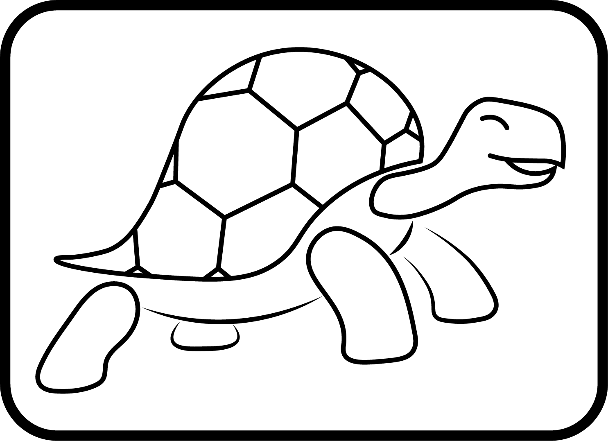

- **[Quick Start Guide](docs/QuickStart.md)**
- **[Cheat Sheet](docs/CheatSheet.md)**
- **[FAQ](docs/FAQ.md)**
- **[Simple Quality][1]**: short free book which is the full user guide
  for artifact and teaches quality best practices.
- **[Design Documents][2]**: also see how [you can do this][3]

[1]: https://vitiral.gitbooks.io/simple-quality/content/
[2]: http://vitiral.github.io/artifact/#artifacts/REQ-1
[3]: https://github.com/vitiral/artifact/wiki/Exporting-Html

Artifact is a design doc tool made for developers. It allows anyone to
easily write and link their design docs both to each other and to source code,
making it easy to track how complete their project is.
Documents are revision controllable, can be rendered as a static
web page and have a full suite of command line tools for searching,
formatting and displaying them.

Writing detailed design documents is one of the core pillars of quality
software development. Design documents are how you capture the requirements
(purpose) of your project and link them to your specifications (how you will
build it). They let you get your ideas on paper before writing code, and help
you have fewer painful refactors. They create a reference for developers and
curious users of how and why your project was developed a certain way, and make
it easier to refactor your project when that becomes necessary.

Even though design documents are critical to the quality of software, there
are very few tools for writing them and integrating them into the larger context
of a project. Artifact aims to fill the major gap in quality best practices by
making writing good design documents *useful* to the average developer.

First of all, artifact makes it easy to write design documents in *text files*
and link them by just specifying their `partof` attribute. This allows
developers to put their design documents under revision control, review them
using regular code review tools and use all the normal text processing tools
(vim, grep, sed, etc) to view, edit and refactor them. Artifact also provides
some command line tools of its own.

Secondly, design documents can be linked to their implementation in source-code
through a language agnostic syntax, simultaniously tracking the project
completion. Once linked, anyone reading the documentation can see what
specification a method is supposed to implement. They can then easily search
for that specification to get an idea of the larger context, making the source
code comments more self documenting.

Finally, artifact exports a beautiful rendered view of the design documents
for hosting on sites like github and viewing in a web browswer ([example][2]).
This completes the self documenting nature and allows anyone, even
non-developers, to view the design documents of their project.

In this way, artifact aims to unify all of the other quality best practices
while also making development easier and more fun.

### Pre-release notice
Artifact is now feature complete for 1.0. The 0.6 release has been released and
will have about a month long soak process while the tool is used by as many
projects as possible. Further changes before 1.0 are not expected, but may
still be necessary. After the soak, the plan is to cut the 1.0 release which
will disallow backwards incompatible changes.

#### Future Improvements
- [#85][10]: Web Server requirements, including editing functionality
- [#58][11]: Test Tracking Server/Database for tracking regression tests

[10]: https://github.com/vitiral/artifact/issues/85
[11]: https://github.com/vitiral/artifact/issues/58

## Contributors

Please check out the [Contributor Guide][20]

[20]: https://github.com/vitiral/artifact/wiki

## Licensing
All documentation and tutorials for the artifact application are released under
the CC0 Creative Commons Public Domain License with the intent that you should
feel free to copy, paste and modify any of the designs, guides or examples
for any purpose without the need of attribution. You can read more about CC0 here:
https://creativecommons.org/publicdomain/

The CC0 license applies to:
- All project [docs](docs)
- The [Artifact Design Documents](http://vitiral.github.io/artifact/#artifacts/REQ-1)
    (also located in `design/`)
- The Artifact Documentation (located in `docs/`)
- The [Artifact Wiki](https://github.com/vitiral/artifact/wiki)
- Any documents created by `art init` (in `src/cmd/data`)
- Any documents created by `art tutorial` (n `src/cmd/data`)

The artifact logo (named Tula) is licensed under Creative Commons
Attribution-ShareAlike (CC BY-SA) and can be used by the artifact project for
any purpose without needing additional attribution. The artifact logo is located
in `logo/` and was originally created by @packapotatoes

The artifact library and Web UI (located in `src/` and `web-ui/src`) are
licensed under the LGPLv3+, except for files which say otherwise in their
header or folders containing a different LICENSE.txt. See LICENSE.txt for more
information.

