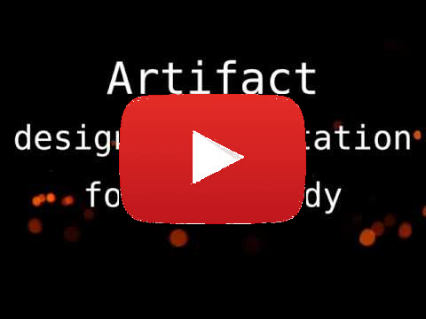

[][4]

- **[Installation Guide](docs/Installation.md)**
- **[Quick Start Guide](docs/QuickStart.md)**
- **[Cheat Sheet](docs/CheatSheet.md)**
- **[FAQ](docs/FAQ.md)**
- **[Simple Quality][1]**: short free book which is the full user guide
  for artifact and teaches quality best practices.
- **[Design Documents][2]**: also see how [you can do this][3]
- **[Support This Project on Patreon][5]**

[1]: https://vitiral.gitbooks.io/simple-quality/content/
[2]: http://vitiral.github.io/artifact/#artifacts/REQ-1
[3]: https://github.com/vitiral/artifact/wiki/Exporting-Html
[4]: https://www.youtube.com/watch?v=kMzxKVkKLlE
[5]: https://www.patreon.com/user?u=7618979

# Artifact: design documentation for everybody


Artifact is the simple, linkable and trackable design documentation tool for
everybody. It allows anyone to write and link their design docs both to each
other and to source code, making it easy to track how complete their project
is. Documents are revision controllable, can be rendered as a static web page
and have a full suite of command line tools for searching, displaying, checking
and formatting them.

Writing detailed design documents is one of the core pillars of quality software
development. Design documents are how you capture the requirements (purpose) of
your project and link them to your specifications (how you will build it). They
let you get your ideas on paper before writing code, and help you have fewer
painful refactors. They create a reference for developers and curious users of
how and why your project was developed a certain way, and make it easier to
refactor your project when that becomes necessary.

Even though design documents are critical to the quality of software, there
are very few tools for writing them and integrating them into the larger context
of a project. Artifact aims to fill the major gap in quality best practices by
making writing good design documents *useful* to the average developer.

First of all, artifact makes it easy to write design documents in *text files*
and link them by just specifying their `partof` attribute. This allows
developers to put their design documents under revision control, review them
using regular code review tools and use all the normal text processing tools
(vim, grep, sed, etc) to view, edit and refactor them. Artifact also provides
some command line tools of its own.

Secondly, design documents can be linked to their implementation in source-code
through a language agnostic syntax, simultaniously tracking the project
completion. Once linked, anyone reading the documentation can see what
specification a method is supposed to implement. They can then easily search
for that specification to get an idea of the larger context, making the source
code comments more self documenting.

Finally, artifact exports a beautiful rendered view of the design documents
for hosting on sites like github and viewing in a web browswer ([example][2]).
This completes the self documenting nature and allows anyone, even
non-developers, to view the design documents of their project. Rendered
artifacts contain *links to the source code*. Seeing a `#SPC-foo` comment in
source tells a developer which specification the code implements, and it is
easy to navigate the code repository by just browsing the design documents.

Furthermore, if the name of a design doc changes, `art check` will tell you
where your dangling references are. Never again will you have to be scared
of refactoring your design documents, it is as easy as refactoring your
code.

In this way, artifact aims to unify all of the other quality best practices
while also making development easier and more fun.  Check out the brief
[commercial video][4] and the [Quick Start Guide](docs/QuickStart.md) for an
introduction.

[](https://travis-ci.org/vitiral/artifact)

## Stability
Artifact is 1.0 software with a strong commitment to backwards compatibility.
The 1.0 release is the "open source" release. Artifact is ready for projects of
any size to use it as their defacto design documentation tool, but the external
tooling may still be lacking for enterprise customers.

The 2.0 release will focus on stabilizing the library for external tooling.
This will position artifact for integration with industry tools such as JIRA
and external regression test tracking software. I am currently seeking
enterprise support, please consider [supporting this project on patreon][5].

The following are stable APIs that should always remain backwards compatible:
- Artifact `.toml` files. Features may be *added*, but should not be removed.
  This includes:
  - Artifact types: `REQ`, `SPC`, `TST`.
  - Artifact fields: `partof`, `text`, `done`.
  - Text format: markdown by default with `[[ART-name]]` links.
- Artifact relationships: explicit partof, auto linking by name, etc.
- Artifact completeness calculated from its relationships.
- Source code links: `#ART-name` anywhere in the source code marks
  the artifact as done.
- `.art/settings.toml` file
- The command line interface, including:
  - The name of the commands (`tutorial`, `init`, `ls`, `check`, `fmt`, etc).
  - Existing flags for each command.
  - The functional checks that are completed (i.e. dangling artifact names)
  - `art serve` default port of 5373 on localhost

The following should remain relatively stable but may have minor tweaks
before 2.0:
- The output of commands, including:
  - The format of the output. I.e. you should not rely on `art ls` having
    a specific output format.
  - The format of artifacts as performed by `art fmt`.
  - Messages printed directly to terminal.
- The json format returned by `art ls --json` and through the json-rpc
  server from `art serve`
- Anything not mentioned in the first section. If you are unsure, please
  open a ticket.

The following are expected to change a lot before 2.0:
- The web ui. Hopefully the changes will be an almost uniform improvement.
- The `art serve` http interface including its API methods and data format.
- The code and expected functions/types/etc of the library itself should be
  considered highly unstable. Future work will involve breaking it into smaller
  crates that are more stable.
- Logging messages evoked with `art -v`.
- Lots of other things that I can't think of. If you are unsure or concerned,
  open a ticket.

Artifact will continue to be released using a continuous-release cycle
with extensive unit and integration tests. If you find a bug please
open a ticket.

## Contributors
To set up a build environment and run tests, simply run:

```bash
git clone git@github.com:vitiral/artifact.git && cd artifact
source env  # installs environment to `target/env`
just test-all
```

Note: `source env` will take a while as it (locally) installs
build/test/lint/fmt toolchains for rust, node.js and python from scratch. It
does not touch ANYTHING in your global environment.

A quick source code overview:
- `justfile` contains build/test/etc scripts
- design documents are in `design/`
- rust source code is in `src/`
- elm source code (html frontend) is in `web-ui/src/`
- selenium (end-to-end web) tests are in `web-ui/sel_tests/`

## Licensing

### Goals
The intent of the artifact licensing is that:
- The artifact application remains open source under a copy-left license
  but can be linked and built upon in any way (LGPLv3+)
- Anything generated by artifact can be licensed any way the user wishes
  to, including the built static html pages.
- Any documents, tutorials or specifications for artifact (except the code
  and logo) remain public domain and can be used for any purpose at all.

### Specifics
All documentation and tutorials for the artifact application are released under
the CC0 Creative Commons Public Domain License with the intent that you should
feel free to copy, paste and modify any of the designs, guides examples or
exported data for any purpose (including commercial) without the need of
attribution. You can read more about CC0 here:
https://creativecommons.org/publicdomain/

The CC0 license applies to:
- All project [docs](docs)
- The [Artifact Design Documents](http://vitiral.github.io/artifact/#artifacts/REQ-1)
    (also located in `design/`)
- The Artifact Documentation (located in `docs/`) except the logo in `docs/logo`
- The [Artifact Wiki](https://github.com/vitiral/artifact/wiki)
- Any file or data created by any artifact command, including:
    - documents created by `art init`
    - documents created by `art tutorial`
    - compiled html/css/json files created by `art export`

The artifact logo (named Tula) is licensed under Creative Commons
Attribution-ShareAlike (`CC BY-SA`) and can be used by the artifact project for
any purpose without needing additional attribution. The artifact logo is located
in `docs/logo` and was originally created by
[packapotatoes](https://github.com/packapotatoes).

The artifact source code (located in `src/` and `web-ui/src`) are licensed under
the LGPLv3+, except for files which say otherwise in their header or folders
containing a different `LICENSE` file. See [LICENSE.txt](LICENSE.txt) for more
information.
