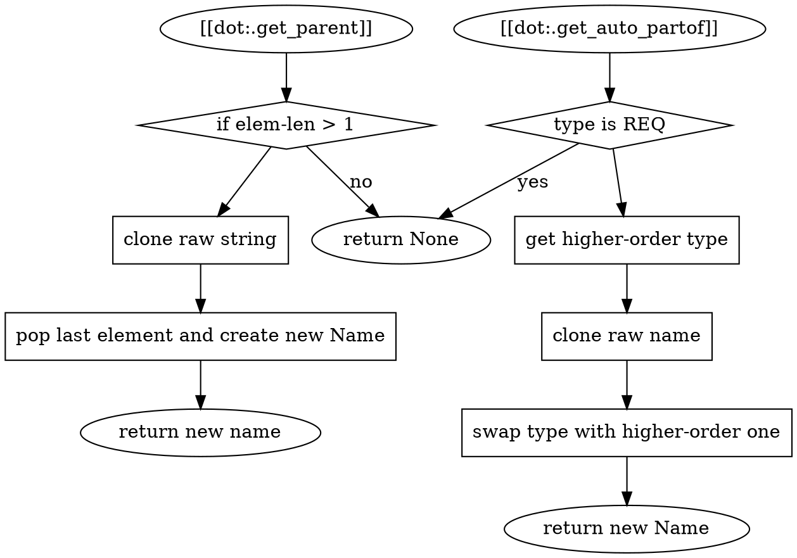

# REQ-data-family
An artifact (name) has the following "family" defined:

```dot
digraph G {
    subgraph cluster_allowed {
        label=<<b>allowed partof</b>>;
        REQ -> SPC -> TST;
        REQ -> TST;

        REQ -> REQ;
        SPC -> SPC;
        TST -> TST;
    }

    subgraph cluster_relationship {
        label=<<b>auto family</b>>;
        "REQ-root"
            -> {"REQ-root-child" [color=blue]}
            [label="is parent of"; color=blue; fontcolor=blue];
        "REQ-root" -> "SPC-root" [label="is auto-partof"];
        "SPC-root"
            -> {"SPC-root-child" [color=blue]}
            [label="is parent of"; color=blue; fontcolor=blue];
        "SPC-root" -> "TST-root" [label="is auto-partof"];
    }
}
}
```

## Allowed Partof
The first graph shows what relationships are "allowed". It specifies that:
- `REQ` can be `partof` any type
- `SPC` can be `partof` `SPC` and `TST`
- `TST` can only be `partof` itself.

In essense:
- You can always create "subtypes", i.e. a more specific requirement
- You can create a specification that is "partof" a requirement. This makes
  sense as you want to define your specifications based on your requirements.
- You can create a test that is "partof" a specification OR a requirement.
  For example, white box testing will be based on a specification whereas
  blackbox ("requirements based") testing will be based on a requirement.

## Auto Relationships
The second graph shows the "automatic relationships" of nodes to their
parents.

- A node is automatically a `partof` both its parent and it's auto-partof.
- Artifacts that have only one element are "root" (i.e. REQ-root, REQ-foo, SPC-foo)
- Any artifact that is *not* root has a single parent, which it will automatically
  be a "partof". That parent **must** be defined by the user or it is a hard error
- SPC and TST artifacts have auto-partof elements of the higher-order type (see
  [[REQ-data-type]]. This element is **not required** to exist, but if it does
  they will be linked automatically.

A node can always be partof another node of the same type. In addition, the following type links are allowed

```dot

```

# REQ-data-type

The following attributes must be definable by the user:
- `name`: the artifact name must be given in the form `ART-name`, where `ART`
  is used to determine the type (see below).
- `done`: if any string is given, the artifact is "defined as done", meaning it
  is 100% complete for both implementation and test.
- `partof`: a list (or compressed syntax) of artifact names which this artifact
  is a "partof". Valid and automatic links are defined in [[REQ-data-family]].
- `text`: the description of the artifact which can contain "soft links" to
  other artifacts as well as to code implementations.

## Artifact Type
The type of an artifact is simply its prefix, which must be one of:
- `REQ`: requirement
- `SPC`: design specification
- `TST`: test specification

The order of precedence is:
- `REQ` is "higher order" than `SPC` or `TST`
- `SPC` is "higher order" than `TST`

```dot
digraph G {
    graph [rankdir=LR; splines=ortho]
    REQ -> SPC -> TST
}
```

See [[REQ-data-family]] for how these are related.

# SPC-data-family
The method of determining family is fairly straightforward, as is
detailed in the graph below:



# TST-data-family
partof: TST-data-fuzz
###
Very low level, so no interop testing.

### Sanity Tests
- [[.parent]]: basic checks that `Name::parent()` works as expected.
- [[.auto_partof]]: basic checks that `Name::auto_partof()` works as expected.
- [[.collapse]]: sanity test for collapsing names.
- [[.collapse_invalid]]: sanity test invalid collapsing strings.

### Fuzz Tests
- [[.fuzz_parent]]: use the fuzzed name to determine the parent in a different
  way than the code and validate that they are identical
- [[.fuzz_auto_partof]]: use the fuzzed name to determine the auto_partof
  in a different way than the code and validate that they are identical
- [[.fuzz_auto_partof]]: use the fuzzed name to determine the auto_partof
  in a different way than the code and validate that they are identical
- [[.fuzz_collapse]]: fuzz that the names can be expaneded and
  collapsed.
- [[.fuzz_serde]]: fuzz that names can be serialized/deserialized.
