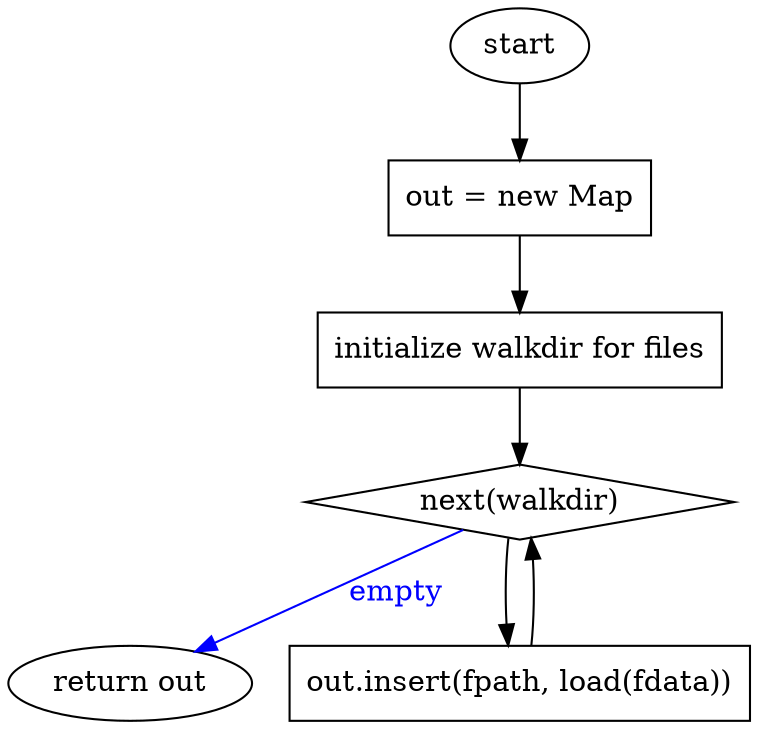

# SPC-data-raw
Loading data shall be performed in a parallel fashion, where walking, reading
and deserializing shall all happen simultaniously.

The basic method shall be:
```
fn load_path<T, F>(path: &Path, load: F) -> Result<HashMap<PathAbs, T>>
    where F: Fn(s: &str) -> Result<T>
```

> `PathAbs` are absolute paths from the path-cache ([[SPC-data-cache]].path).

The basic logic is:


# SPC-data-raw-markdown
An artifact in the markdown format is specified as:

    # <ART-name>
    <optional yaml attributes: partof,done>
    ### <optional, only if there were attributes
    <text>

The process for loading markdown will be:
- set `name,attrs,lines=None,None,[]`
- read one line at a time
- if the line is a name:
    - `out.insert(name, ArtifactRaw {attrs=attrs, text='\n'.join(lines)})`
    - `name = line`
    - continue
- if the line is end of attrs:
    - attrs = Some('\n'.join(lines))
    - lines = []
    - continue
- when the iterator is exhausted
    - store ArtifactRaw with current values


> This looks horrible and I don't know what to do, since the above is pretty
> consise

    ```dot
    digraph G {
    subgraph cluster_iter {
        graph [rankdir=LR];
        "input=byte-stream"
            -> {"out = new Map<Name, ArtifactRaw>" [shape=box]}
            -> {"cur_name,cur_attrs,cur_lines=None,None,[]" [shape=box]}
            -> {iter [label="nextline(stream)", shape=diamond]};
        iter -> "return out" [label="empty"; color=blue; fontcolor=blue];
    }

    subgraph cluster_name {
        iter -> {if_name [label="name_re.match(line)?"; shape=diamond]}
            -> {"if cur_name not None then out.append(current_stuff)" [shape=box]}
    //[label="yes"; color=green; fontcolor=green]
            -> {"cur_name=match" [shape=box]}
            -> iter;
    }
    subgraph cluster_attrs {
        if_name -> {if_attr [lable="attr_end_re.match(line)?"; shape=diamond]}
            -> {"if attrs then ERROR" [shape=box]}
            -> {"attrs=cur_lines; cur_lines=[]" [shape=box]}
           //     [label="yes"; color=green; fontcolor=green]
            -> iter;
    }
    }
    ```

# TST-data-raw
partof:
- SPC-data-raw-markdown
- TST-data-fuzz
###
Testing the deserialization shall require a small testing harness. The goal is that
function from this harness be reused for writing even higher level tests.

The major elements of the harness are:
- An `assert_deser_valid(deser, raw, expected)` which:
    - converts `raw -> result` using `deser(raw)`
    - asserts `expected == result`
    - return value
- An `assert_ser_valid(ser, value, expected)` which:
    - converts `value -> raw` using `ser(value)`
    - asserts `result == expected` with a decent diff
    - return raw
- An `assert_serde(value, expected_raw_toml, expected_raw_md)` function which:
    - does a round trip on the inpult and asserts for all the given types
    - `raw_toml = assert_ser_valid(toml::ser, value, expected_raw_toml)`
    - `assert_de_valid(toml::de, raw_toml, value)`
    - `raw_md = assert_ser_valid(from_markdown, value, expected_raw_md)`
    - `assert_de_valid(to_markdown, raw_md, value)`
- Fuzzing for `ArtifactRaw`, whch creates fuzzed ArtifactRaw objects and runs
  round-trip tests on them.

The fuzzing design is of particular importance, since it is intended to be
used by even higher level test frameworks. The design is the function
```
fuzz_raw_artifacts(these_names: Set<Name>, partofs: Graph)
    -> BTreeMap<Name, ArtifactRaw>
```
- `these_names` is supposed to represent (loosely) the names that exist in
  *this* single file (or representation of a file).
- The `partofs: Graph` is a pre-constructed directed acyclic graph. It
  is constructed as follows:
  - the generated names are split into REQ, SPC and TST, their orders are
    randomized, and then they are concattenated REQ++SPC++TST
  - recall that the following "partof" connections are valid:
    - REQ -> [REQ, SPC, TST] (requirement can be partof REQ SPC or TST)
    - SPC -> [SPC, TST]
    - TST -> TST
  - A list of nodes that can be connected can treated as
    [topologically sorted][1].  We just have to uphold this by only allowing
    any node to only connect to its nodes to its right.
  - A Graph is constructed and edges are added at random with exactly this
    constraint
- The rest of each Artifact is then created as follows:
  - done is randomly defined or not defined. When defined it always had
    len >= 1
  - text is randomly defined or not defined. When defined it can have
    any length <= 50 lines where each line be up to 120 characters
    (this is only to make it more readable when debugging).  It also has the
    following randomly inserted:
    - references to *any* name that exists in `partofs`
    - TODO: references to *any* subname that exists in `subnames`
    - TODO: their own sublocations `{{.art}}` (except `[[]]` instead)

Look into the following:
- https://crates.io/crates/regex_generate: use regex to generate text
    - I'm not sure if `\\w` works, but we should be able to use a character
      class for arbitrary unicode ranges: https://doc.rust-lang.org/regex/regex_syntax/struct.ClassRange.html

[1]: https://en.wikipedia.org/wiki/Topological_sorting
