# SPC-data-structs
## Defined Enums and Structs

It's critical that the valid types are defined at a high level, since
they determine how everything works together.

### Exported Types
These are the types that make up the exported "product" of this library. The
major type is the **Artifact** and its associated **Name**.

```dot
digraph G {
    node [shape=plaintext];

    Type [label=<
<TABLE ALIGN="left" BORDER="0" CELLBORDER="1" CELLSPACING="0">
  <TR><TD PORT="self" BGCOLOR="gray"><b>Type</b></TD><TD><i>enum</i></TD></TR>
  <TR><TD>REQ               </TD><TD PORT="req" >               </TD></TR>
  <TR><TD>SPC               </TD><TD PORT="spc" >               </TD></TR>
  <TR><TD>TST               </TD><TD PORT="tst" >               </TD></TR>
</TABLE>>];

    Name [label=<
<TABLE ALIGN="left" BORDER="0" CELLBORDER="1" CELLSPACING="0">
  <TR><TD PORT="self" BGCOLOR="gray"><b>Name</b></TD><TD><i>struct</i></TD></TR>
  <TR><TD PORT="ty">ty      </TD><TD>Type           </TD></TR>
  <TR><TD>key               </TD><TD PORT="key" >String         </TD></TR>
  <TR><TD>raw               </TD><TD PORT="raw" >String         </TD></TR>
</TABLE>>];

    Artifact [label=<
<TABLE ALIGN="left" BORDER="0" CELLBORDER="1" CELLSPACING="0">
  <TR><TD PORT="self" BGCOLOR="gray"><b>Artifact</b></TD><TD><i>struct</i></TD></TR>
  <TR><TD PORT="name">name      </TD><TD>Name           </TD></TR>
  <TR><TD PORT="pof" >partof    </TD><TD>Set[Name]      </TD></TR>
  <TR><TD PORT="pts" >parts     </TD><TD>Set[Name]      </TD></TR>
  <TR><TD>completed         </TD><TD PORT="comp">Completed      </TD></TR>
  <TR><TD>text              </TD><TD PORT="text">String         </TD></TR>
  <TR><TD PORT="impl">impl_ </TD><TD>Implementation </TD></TR>
  <TR><TD>subnames          </TD><TD PORT="sub" >Set[SubName]   </TD></TR>
  <TR><TD>file              </TD><TD PORT="file">Set[PathAbs]   </TD></TR>
</TABLE>>];

    Completed [label=<
<TABLE ALIGN="left" BORDER="0" CELLBORDER="1" CELLSPACING="0">
  <TR><TD PORT="self" BGCOLOR="gray"><b>Completed</b></TD><TD><i>struct</i></TD></TR>
  <TR><TD>tst               </TD><TD PORT="tst" >f32            </TD></TR>
  <TR><TD>spc               </TD><TD PORT="spc" >f32            </TD></TR>
</TABLE>>];

    Impl [label=<
<TABLE ALIGN="left" BORDER="0" CELLBORDER="1" CELLSPACING="0">
  <TR><TD PORT="self" BGCOLOR="gray"><b>Impl</b></TD><TD><i>enum</i></TD></TR>
  <TR><TD>Done              </TD><TD PORT="done">String                 </TD></TR>
  <TR><TD>Code              </TD><TD PORT="code">ImplCode               </TD></TR>
  <TR><TD>NotImpl           </TD><TD PORT="not" >                       </TD></TR>
</TABLE>>];

    ImplCode [label=<
<TABLE ALIGN="left" BORDER="0" CELLBORDER="1" CELLSPACING="0">
  <TR><TD PORT="self" BGCOLOR="gray"><b>ImplCode</b></TD><TD><i>struct</i></TD></TR>
  <TR><TD>primary           </TD><TD PORT="prim">Option[CodeLoc]        </TD></TR>
  <TR><TD>secondary         </TD><TD PORT="sec" >Map[SubName, CodeLoc]  </TD></TR>
</TABLE>>];

    CodeLoc [label=<
<TABLE ALIGN="left" BORDER="0" CELLBORDER="1" CELLSPACING="0">
  <TR><TD PORT="self" BGCOLOR="gray"><b>CodeLoc</b></TD><TD><i>struct</i>  </TD></TR>
  <TR><TD>file              </TD><TD PORT="file">PathAbs            </TD></TR>
  <TR><TD>line              </TD><TD PORT="line">usize              </TD></TR>
  <TR><TD>col               </TD><TD PORT="col" >usize              </TD></TR>
</TABLE>>];

    PathAbs [label=<
<TABLE ALIGN="left" BORDER="0" CELLBORDER="1" CELLSPACING="0">
  <TR><TD PORT="self" BGCOLOR="gray"><b>PathAbs</b></TD><TD><i>cached newtype</i></TD></TR>
  <TR><TD>0                 </TD><TD PORT="path">PathBuf        </TD></TR>
</TABLE>>];

    SubName [label=<
<TABLE ALIGN="left" BORDER="0" CELLBORDER="1" CELLSPACING="0">
  <TR><TD PORT="self" BGCOLOR="gray"><b>SubName</b></TD><TD><i>struct</i></TD></TR>
  <TR><TD>raw                   </TD><TD PORT="raw" >String      </TD></TR>
  <TR><TD>key                   </TD><TD PORT="key" >String      </TD></TR>
</TABLE>>];

    { rank = same {Type, Name, Artifact, Completed}}
    Artifact:name   -> Name [constraint=false];
    Artifact:pof    -> Name [constraint=false];
    Artifact:pts    -> Name [constraint=false];
    Artifact:comp   -> Completed;
    Name:ty         -> Type [constraint=false];

    { rank = same {Impl, ImplCode, CodeLoc, PathAbs}}
    Artifact:impl   -> Impl;
    Impl:code       -> ImplCode;
    ImplCode:prim   -> CodeLoc;
    ImplCode:sec    -> CodeLoc;
    CodeLoc:file    -> PathAbs;
    Artifact:file   -> PathAbs;

    Artifact:sub    -> SubName
    ImplCode:sec    -> SubName;
}
```

### Raw Data Types
These types define the "raw data" format of artifact.

**ArtifactRaw**: (stored with key of `Name`)
- done: `Option[String]`
- partof: `Option[HashSet[Name]]`
- text: `Option[TextRaw]`

**TextRaw**: just a newtype with some serialization guarantees
to make it prettier and ensure serialization is possible between
all of the supported formats.
