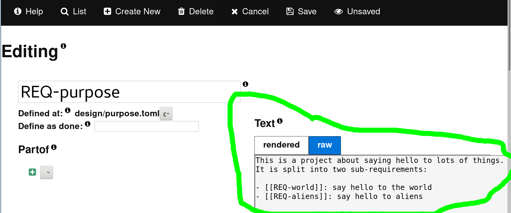
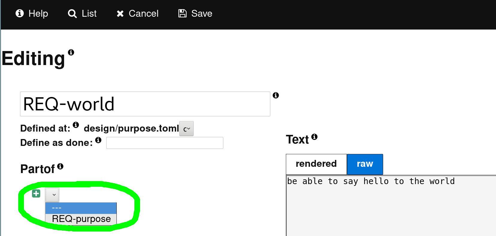

# Artifact Quick Start Guide

Artifact is a tool for helping you track your "artifacts" and link them to your
source code (making your source code self documenting).

This guide is made for those who want to just get an overview of the tool or for
developers who are already knowledgeable in requirements tracking. It is highly
recommended that most people read the short [Simple Quality][1] book, which is
the primary tutorial for artifact while also teaching quality best practices.

For an ultra quick intro, see the [commercial video on youtube][3].

## Hello World Project

We will create a "hello world" application from start to finish. Use the
[Cheat Sheet](CheatSheet.md) and the [FAQ](FAQ.md) to help you with any
questions during this tutorial. If you are struggling, it is suggested you read
the [Simple Quality][1] book instead.

Start at the [Installation Guide](Installation.md) and install artifact on
your system, or just follow along by looking at the images and the
[static site][2].

### Initialize Your Project
Use an empty directory and run `art init`. Now put a requirement in
`design/purpose.toml` which will define the high level purpose of our "hello
world" application.

### Create Your Purpose Artifact
**In a text editor**:
> Note: the `[[...]]` syntax is just sugar to make links in the web-ui


Or view and edit in a web-browser using `art serve` and navigating to 
http://127.0.0.1:5373.

**Go to `REQ-purpose` in the list.**


**Click the "Edit" button**


**Edit the text**



**Click the "Save" button**


In both cases the new artifact gets saved in `design/purpose.toml`

### Add Sub-Artifacts
Now let's add the two parts of `REQ-purpose` by creating `REQ-world`
and `REQ-aliens` and making them "partof" `REQ-purpose`.

**In a text editor** 


Or in a web browser

**Click the "Create New" button**


**Edit both above and add as "partof" `REQ-purpose`**



### Create a Design Specification
Now we will create a design specification for `REQ-world`. We do not have
to use `partof` because the names are identical (only the type differs).
Using the same process as above, add these artiacts:
```toml
[SPC-world]
text = '''
The hello-world function shall print hello
'''
```

We can also define a test which is automatically a "partof" SPC-world:
```toml
[TST-world]
text = '''
We will make a test later.
'''
```

### Implement and Link to Code
Okay, we have designed the "world" part of our application. Now we should
actually program it. We create a `src/` directory and add it to
`.art/settings.toml`
```toml
artifact_paths = [
    "{repo}/design"  # was already there
]
code_paths = [
    "{repo}/src",
]
```

We now create our source code at `src/hello.py`. Writing `#SPC-world` 
anywhere in our source code **marks `SPC-world` as implemented**. The source
code does not have to be in python, any utf-8 file with `#SPC-name` patterns in
it can be used.

```python
def hello_world():
    """Say hello to the world
    partof: #SPC-world
    """
    print("hello world!")
```

### View Completion Status
Now run: `art ls`. This lists our artifact's so far We can see that `SPC-world` is 100% done but
not tested.


Or view in the web-browser.


### Export as Static Html
To export as static html and host anywhere (including github pages):
```
art export html --path-url "https://$GIT_URL/blob/$(git rev-parse --verify HEAD)/{path}#L{line}")
```

> For more information on exporting html, see [Exporting Html](ExportingHtml.md)

This will add links to the source code. Go to
https://vitiral.github.io/artifact-example/#artifacts/req-purpose 
and click on the "Implemented" link for an example.


This will take you to your repository's source code


## Next Steps
For a quick overview of all features, check out the
[Cheat Sheet](CheatSheet.md).

For a more in depth tutorial, see the [Simple Quality][1] book.

[1]: https://vitiral.gitbooks.io/simple-quality/content/
[2]: https://vitiral.github.io/artifact-example/#artifacts/req-purpose
[3]: https://www.youtube.com/watch?v=LOWiF3P6zSw
