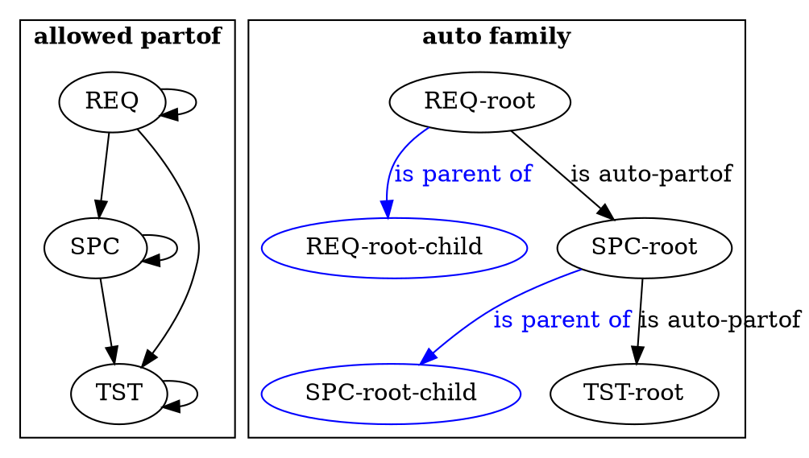
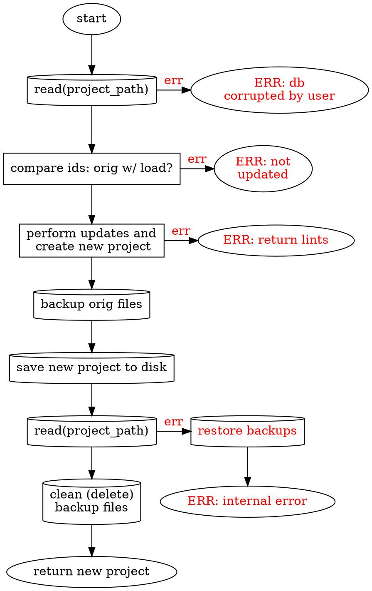
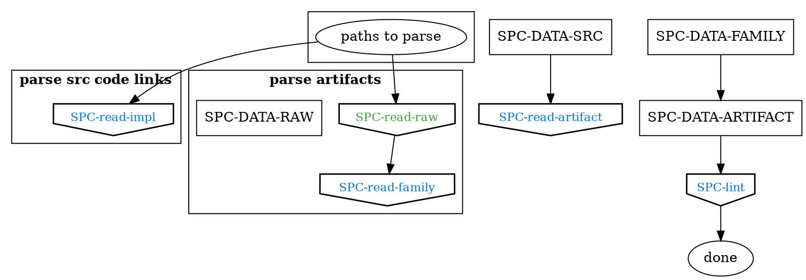
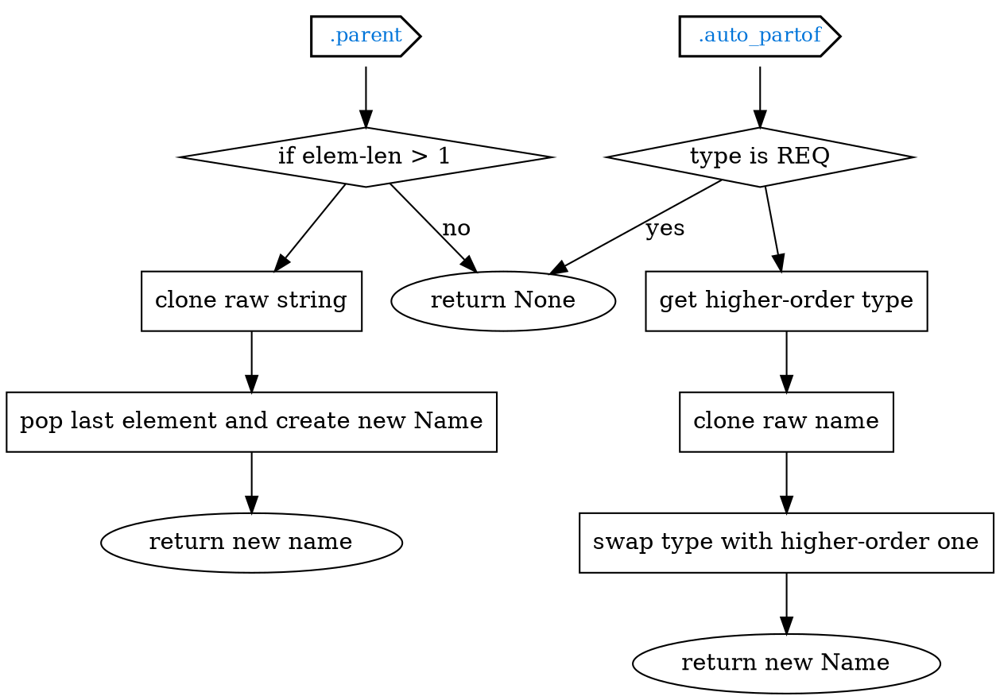
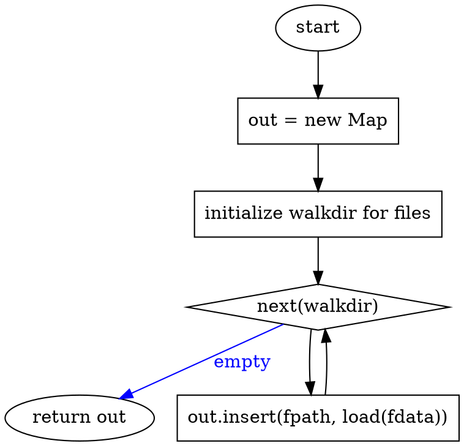
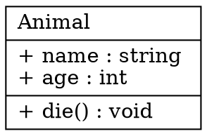

Artifact design docs, exported to markdown.

See [REQ-purpose](#REQ-PURPOSE) for the top level artifact.

> Note: Export docs like this with `art export md exported.md`
>
> Settings are in `.art/settings.toml`

# Table Of Contents
- <a style="font-weight: bold; color: #FF851B" title="REQ-DATA" href="#REQ-DATA">REQ-data</a>
- <a style="font-weight: bold; color: #FF851B" title="REQ-PURPOSE" href="#REQ-PURPOSE">REQ-purpose</a>
- <a style="font-weight: bold; color: #FF4136" title="REQ-WEB" href="#REQ-WEB">REQ-web</a>
- <a style="font-weight: bold; color: #FF851B" title="SPC-CLI" href="#SPC-CLI">SPC-cli</a>
- <a style="font-weight: bold; color: #FF851B" title="SPC-CLI-LS" href="#SPC-CLI-LS">SPC-cli-ls</a>
- <a style="font-weight: bold; color: #FF851B" title="SPC-FAMILY" href="#SPC-FAMILY">SPC-family</a>
- <a style="font-weight: bold; color: #FF4136" title="SPC-FRONTEND" href="#SPC-FRONTEND">SPC-frontend</a>
- <a style="font-weight: bold; color: #FF851B" title="SPC-IMPL" href="#SPC-IMPL">SPC-impl</a>
- <a style="font-weight: bold; color: #0074D9" title="SPC-LINT" href="#SPC-LINT">SPC-lint</a>
- <a style="font-weight: bold; color: #0074D9" title="SPC-MODIFY" href="#SPC-MODIFY">SPC-modify</a>
- <a style="font-weight: bold; color: #0074D9" title="SPC-MODIFY-UPDATE" href="#SPC-MODIFY-UPDATE">SPC-modify-update</a>
- <a style="font-weight: bold; color: #0074D9" title="SPC-NAME" href="#SPC-NAME">SPC-name</a>
- <a style="font-weight: bold; color: #0074D9" title="SPC-READ" href="#SPC-READ">SPC-read</a>
- <a style="font-weight: bold; color: #0074D9" title="SPC-READ-ARTIFACT" href="#SPC-READ-ARTIFACT">SPC-read-artifact</a>
- <a style="font-weight: bold; color: #FF4136" title="SPC-READ-CACHE" href="#SPC-READ-CACHE">SPC-read-cache</a>
- <a style="font-weight: bold; color: #0074D9" title="SPC-READ-FAMILY" href="#SPC-READ-FAMILY">SPC-read-family</a>
- <a style="font-weight: bold; color: #0074D9" title="SPC-READ-IMPL" href="#SPC-READ-IMPL">SPC-read-impl</a>
- <a style="font-weight: bold; color: #3DA03D" title="SPC-READ-RAW" href="#SPC-READ-RAW">SPC-read-raw</a>
- <a style="font-weight: bold; color: #3DA03D" title="SPC-READ-RAW-MARKDOWN" href="#SPC-READ-RAW-MARKDOWN">SPC-read-raw-markdown</a>
- <a style="font-weight: bold; color: #FF851B" title="SPC-STRUCTS" href="#SPC-STRUCTS">SPC-structs</a>
- <a style="font-weight: bold; color: #FF4136" title="SPC-TEST" href="#SPC-TEST">SPC-test</a>
- <a style="font-weight: bold; color: #3DA03D" title="TST-FRAMEWORK" href="#TST-FRAMEWORK">TST-framework</a>
- <a style="font-weight: bold; color: #FF851B" title="TST-FUZZ" href="#TST-FUZZ">TST-fuzz</a>
- <a style="font-weight: bold; color: #3DA03D" title="TST-READ-ARTIFACT" href="#TST-READ-ARTIFACT">TST-read-artifact</a>
- <a style="font-weight: bold; color: #3DA03D" title="TST-READ-RAW" href="#TST-READ-RAW">TST-read-raw</a>
- <a style="font-weight: bold; color: #0074D9" title="TST-UNIT" href="#TST-UNIT">TST-unit</a>


# REQ-data
<details>
<summary><b>metadata</b></summary>
<b>partof:</b><br>
<li><a style="font-weight: bold; color: #FF851B" title="REQ-PURPOSE" href="#REQ-PURPOSE">REQ-purpose</a></li>
<b>parts:</b><br>
<li><a style="font-weight: bold; color: #FF851B" title="SPC-FAMILY" href="#SPC-FAMILY">SPC-family</a></li>
<li><a style="font-weight: bold; color: #FF851B" title="SPC-IMPL" href="#SPC-IMPL">SPC-impl</a></li>
<li><a style="font-weight: bold; color: #0074D9" title="SPC-LINT" href="#SPC-LINT">SPC-lint</a></li>
<li><a style="font-weight: bold; color: #0074D9" title="SPC-MODIFY" href="#SPC-MODIFY">SPC-modify</a></li>
<li><a style="font-weight: bold; color: #0074D9" title="SPC-NAME" href="#SPC-NAME">SPC-name</a></li>
<li><a style="font-weight: bold; color: #0074D9" title="SPC-READ" href="#SPC-READ">SPC-read</a></li>
<li><a style="font-weight: bold; color: #FF851B" title="SPC-STRUCTS" href="#SPC-STRUCTS">SPC-structs</a></li>
<li><a style="font-weight: bold; color: #FF4136" title="SPC-TEST" href="#SPC-TEST">SPC-test</a></li>
<b>file:</b> <a href="https://github.com/vitiral/artifact/blob/master/design/data/purpose.md#L1">design/data/purpose.md</a><br>
<b>impl:</b> <i>not implemented</i><br>
<b>spc:</b>60.00&nbsp;&nbsp;<b>tst:</b>34.70<br>
<hr>
</details>


The `artifact-data` crate defines a lightweight and robust API for
deterministically deserializing, processing and reserializing artifacts from a
project directory.

This crate treats an "artifact project" (which is a path to a folder
containing a `.art/` directory) as a transactional database, ensuring
consistency and validity when any update is made. It does this by creating a
unique-hash of the reduced form of any artifact, and requires all updates to
that database to have the *correct* original unique-hash before updates are
allowed.

This allows external applications to use the filesystem *itself* as a "database"
of sorts, and allows you to simultaniously edit artifacts via (for example)
*both* a Web-UI *and* a local text-editor and see real-time updates in both
places -- without having to worry about loosing any of your work.

These requirements are implemented through the following specifications:
- <a style="font-weight: bold; color: #0074D9" title="SPC-READ" href="#SPC-READ">SPC-read</a>: the "read" part of the CRUD database. Allows you to load an
  artifact project.
- <a style="font-weight: bold; color: #0074D9" title="SPC-MODIFY" href="#SPC-MODIFY">SPC-modify</a>: the "Create + Update + Delete" part of the CRUD database.
- <a style="font-weight: bold; color: #FF851B" title="SPC-STRUCTS" href="#SPC-STRUCTS">SPC-structs</a>: the exported types of this module and their purpose.
- <a style="font-weight: bold; color: #0074D9" title="SPC-NAME" href="#SPC-NAME">SPC-name</a>: the valid types of artifacts and the attrs in their name.
- <a style="font-weight: bold; color: #FF851B" title="SPC-FAMILY" href="#SPC-FAMILY">SPC-family</a>: the valid and automatic relationships between artifacts
- <a style="font-weight: bold; color: #FF851B" title="SPC-IMPL" href="#SPC-IMPL">SPC-impl</a>: how artifacts are implemented.
- <a style="font-weight: bold; color: #0074D9" title="SPC-LINT" href="#SPC-LINT">SPC-lint</a>: the design of error handling (spoiler: it's all "lints")

The following test helpers are exported under feature flag `test-helpers`:
- <a style="font-weight: bold; color: #FF851B" title="TST-FUZZ" href="#TST-FUZZ">TST-fuzz</a>: this library shall export **and use** fuzz testing primitives
  throughout its infrastructure
- <a style="font-weight: bold; color: #3DA03D" title="TST-FRAMEWORK" href="#TST-FRAMEWORK">TST-framework</a>: this library shall export **and use** a testing framework
  which allows you to express the expected state of a project _as only data_
  and which makes clear assertions using these expected values.


# REQ-purpose
<details>
<summary><b>metadata</b></summary>
<b>partof:</b> <i>none</i></a><br>
<b>parts:</b><br>
<li><a style="font-weight: bold; color: #FF851B" title="REQ-DATA" href="#REQ-DATA">REQ-data</a></li>
<li><a style="font-weight: bold; color: #FF4136" title="REQ-WEB" href="#REQ-WEB">REQ-web</a></li>
<li><a style="font-weight: bold; color: #FF851B" title="SPC-CLI" href="#SPC-CLI">SPC-cli</a></li>
<li><a style="font-weight: bold; color: #3DA03D" title="TST-FRAMEWORK" href="#TST-FRAMEWORK">TST-framework</a></li>
<b>file:</b> <a href="https://github.com/vitiral/artifact/blob/master/design/purpose.md#L1">design/purpose.md</a><br>
<b>impl:</b> <i>not implemented</i><br>
<b>spc:</b>45.70&nbsp;&nbsp;<b>tst:</b>33.70<br>
<hr>
</details>

> This is a work in progress
>
> These are the design documents. For user documentation
> see the project's [README][artifact].

**These are the developer design documents. For user documents and project
information, see the project's [README][artifact].**

## Overview for Artifact
The goal of artifact is to be a simple, linkable and trackable design
documentation tool for everybody.

This may seem trivial, but it's not. A useful design doc tool must have *at least*
the following characteristics:
- Allow simple linking of requirements -> specifications -> tests.
- Easily link to source code (through the source documentation) to determine
  completeness.
- Be revision controllable (text based).
- Have a unix-like command line interface for interacting with your design docs.
- Have a web-ui for viewing and editing rendered documents.
- Provide interop functionality like subcommand and data export for integration
  with external tools and plugins.
- Be scalable to any size of project (i.e. fast+cached).

These features will empower developers to track their own design docs and make
it possible for them to use their design docs to provide documentation and
guidance for contributors and teamates.

[artifact]: https://github.com/vitiral/artifact

## What is an "Artifact"?
`artifact` allows the user to define any number of what it calls "Artifacts".
An Artifact is simply a part of a document (i.e. json, toml or extended
markdown) which:
- Is a single entity composed of a specific set of attributes defined below.
- <a style="font-weight: bold; color: #0074D9" title="SPC-NAME" href="#SPC-NAME">SPC-name</a>: Has a project-wide unique `Name` beginning with one of `REQ`,
  `SPC` or `TST`, which is the artifact's `Type` (<a style="font-weight: bold; color: #0074D9" title="SPC-NAME.TYPE" href="#SPC-NAME">SPC-name.type</a>).
- <a style="font-weight: bold; color: #FF851B" title="SPC-FAMILY" href="#SPC-FAMILY">SPC-family</a>: Has a `partof` attribute which makes it a dependency of other
  artifacts.
- <a style="font-weight: bold; color: #FF851B" title="SPC-IMPL" href="#SPC-IMPL">SPC-impl</a>: Has a `text` attribute which allows you to write out the
  artifact's specification, as well as create subnames which can be linked in
  source code (i.e. `ART-name.subname`)
  - <a style="font-weight: bold; color: #FF851B" title="SPC-IMPL.DONE" href="#SPC-IMPL">SPC-impl.done</a>: alternatively can be forced as implemented through the
    `done` attribute
- <a style="font-weight: bold; color: #0074D9" title="SPC-READ-IMPL" href="#SPC-READ-IMPL">SPC-read-impl</a>: Can be linked in source code using `#ART-name` or
  `#ART-name.subname`, which allows you to "implement" the artifact directly.
- <a style="font-weight: bold; color: #0074D9" title="SPC-READ-ARTIFACT.COMPLETED" href="#SPC-READ-ARTIFACT">SPC-read-artifact.completed</a>: Tracks spc and tst completion of
  artifacts by (roughly) averaging the completeness of their children + the
  completion of their subparts, where TST's only affect the TST completion of
  REQ and SPC.

Artifacts are first and formost intended to be simple and lightweight. They
try to stay out of your way and *express what you want, when you want it*.

## Design Architecture
The design of artifact is split into several sub-modules

- <a style="font-weight: bold; color: #FF851B" title="REQ-DATA" href="#REQ-DATA">REQ-data</a>: the "data" module, which acts as a filesystem database for CRUD
  operations on the user's artifacts.
- <a style="font-weight: bold; color: #FF851B" title="SPC-CLI" href="#SPC-CLI">SPC-cli</a>: The CLI interface. Artifact always aims to be a "developer first" tool, and
  having a full featured CLI with search+lint+export commands is one of the ways it
  accomplishes that goal.
- <a style="font-weight: bold; color: #FF4136" title="REQ-WEB" href="#REQ-WEB">REQ-web</a>: the webui frontend/backend implementation, which is one of the
  main ways that users actually use artifact.


# REQ-web
<details>
<summary><b>metadata</b></summary>
<b>partof:</b><br>
<li><a style="font-weight: bold; color: #FF851B" title="REQ-PURPOSE" href="#REQ-PURPOSE">REQ-purpose</a></li>
<b>parts:</b><br>
<li><a style="font-weight: bold; color: #FF4136" title="SPC-FRONTEND" href="#SPC-FRONTEND">SPC-frontend</a></li>
<b>file:</b> <a href="https://github.com/vitiral/artifact/blob/master/design/purpose.md#L1">design/purpose.md</a><br>
<b>impl:</b> <i>not implemented</i><br>
<b>spc:</b>0.00&nbsp;&nbsp;<b>tst:</b>0.00<br>
<hr>
</details>

The web interface for artifact should be designed to behave very similar to the
CLI/text based interface, except it should take advantage of everything that a web
interface can.

Main attributes:
- Works directly on the file system. Any database introduced should only be used for improving performance (invisible to the user).
- <span title="Not Implemented" style="color: #FF4136"><b><i>.secure</i></b></span>: this is definitely TODO, not sure how it will be accomplished ATM. Probably just require non-local host hosting to require a password and use HTTPS (nothing crazy).
- Fast for _single users and small groups_. Explicitly not designed as a whole org editing portal, users are encouraged to make small changes and use existing code review tools for changing design docs.

# Architecture
The basic architecture of the web UI is split into two components:
- <span title="Not Implemented" style="color: #FF4136"><b><i>.backend</i></b></span>: this will be a simple json-rpc server which uses the <a style="font-weight: bold; color: #FF851B" title="REQ-DATA" href="#REQ-DATA">REQ-data</a> crate
  to do all of it's heavy lifting. <a style="font-weight: bold; color: #FF851B" title="REQ-DATA" href="#REQ-DATA">REQ-data</a> will ensure data consistency and error
  handling.
- <span title="Not Implemented" style="color: #FF4136"><b><i>.frontend</i></b></span>: the frontend will be a single page application which
  accomplishes a majority of the goals of artifact, including real-time
  feedback, graphing and visualization of requirements. It and the CLI are the
  two major "user facing" components of artifact.


# SPC-cli
<details>
<summary><b>metadata</b></summary>
<b>partof:</b><br>
<li><a style="font-weight: bold; color: #FF851B" title="REQ-PURPOSE" href="#REQ-PURPOSE">REQ-purpose</a></li>
<b>parts:</b><br>
<li><a style="font-weight: bold; color: #FF851B" title="SPC-CLI-LS" href="#SPC-CLI-LS">SPC-cli-ls</a></li>
<b>file:</b> <a href="https://github.com/vitiral/artifact/blob/master/design/cli.md#L1">design/cli.md</a><br>
<b>impl:</b> <a href="https://github.com/vitiral/artifact/blob/master/artifact-app/src/lib.rs#L59">artifact-app/src/lib.rs[58]</a><br>
<b>spc:</b>77.10&nbsp;&nbsp;<b>tst:</b>0.00<br>
<hr>
</details>


The CLI is the primary developer interatction with artifact, alongside the Web
UI for visualizing the artifacts. The main goal of the CLI is to provide the
tools that every developer is used to in a typical development tool. This
includes:


- <span title="Not Implemented" style="color: #FF4136"><b><i>.init</i></b></span>: Initialize a project for using artifact. This is pretty basic, just need
  a `.art` folder with a `settings.toml` and an initial `design/` folder.
- <a title="/home/rett/open/artifact/artifact-app/src/check.rs[34]" style="color: #0074D9" href="https://github.com/vitiral/artifact/blob/master/artifact-app/src/check.rs#L35"><b>.check</b></a>: checking for errors AND warnings with a return code if there is an error.
    - If there are only warnings the return code == 2. Otherwise it == 1.
- <a title="/home/rett/open/artifact/artifact-app/src/fmt.rs[38]" style="color: #0074D9" href="https://github.com/vitiral/artifact/blob/master/artifact-app/src/fmt.rs#L39"><b>.fmt</b></a>: auto format the project.
  - `--type` flag to change the filetype.
- <a style="font-weight: bold; color: #FF851B" title="SPC-CLI-LS" href="#SPC-CLI-LS">SPC-cli-ls</a>: listing/searching for artifacts, see the full specification.
- <a title="/home/rett/open/artifact/artifact-app/src/serve/mod.rs[16]" style="color: #0074D9" href="https://github.com/vitiral/artifact/blob/master/artifact-app/src/serve/mod.rs#L17"><b>.serve</b></a>: the command to start the web backend.


All subcommands should include the following flags:
- `-v / --verbose` for setting the logging verbosity.
- `--work-dir` for setting the working directory to run the command out of.


# SPC-cli-ls
<details>
<summary><b>metadata</b></summary>
<b>partof:</b><br>
<li><a style="font-weight: bold; color: #FF851B" title="SPC-CLI" href="#SPC-CLI">SPC-cli</a></li>
<b>parts:</b> <i>none</i></a><br>
<b>file:</b> <a href="https://github.com/vitiral/artifact/blob/master/design/cli.md#L1">design/cli.md</a><br>
<b>impl:</b> <a href="https://github.com/vitiral/artifact/blob/master/artifact-app/src/ls.rs#L17">artifact-app/src/ls.rs[16]</a><br>
<b>spc:</b>62.50&nbsp;&nbsp;<b>tst:</b>0.00<br>
<hr>
</details>

The `art ls` command shall be used to list information about the artifacts in a
project.

`ls` is the primary window into a user's artifacts, creating a simple interface
to glimpse large amounts of information.

## <a title="/home/rett/open/artifact/artifact-app/src/ls.rs[31]" style="color: #0074D9" href="https://github.com/vitiral/artifact/blob/master/artifact-app/src/ls.rs#L32"><b>.args</b></a>: Arguments
`art ls` with no commands will simply print all artifacts with standard
settings, each on a single line.

The args are as follows:
- `SEARCH str`: positional argument detailing which artifacts to display
  By default, this will be interpreted as an Artifact Name and can therefore
  only display one artifact. However, if pattern searching is selected, it
  will be interpreted as a rust regexp
- `display`: flags that control what information will be displayed
- `pattern`: searh SEARCH with a regex pattern. The flag specifies which fields
  should be searched.
- `completed/tested`: flags which control what percentage completed/tested to
  display
- <span title="Not Implemented" style="color: #FF4136"><b><i>.long</i></b></span>: the `-l` flag prints the artifact in "long" form. Without it it
  is printed in <span title="Not Implemented" style="color: #FF4136"><b><i>.table</i></b></span> form.

## <span title="Not Implemented" style="color: #FF4136"><b><i>.color</i></b></span>: Color
In order to make viewing of information via cmdline easier, artifact **shall**
colorize it's output to make it clear which items are done or not done or in
error.

The following are the general rules:
- Names that are complete will be `green`.
- Names that are almost complete will be `blue`.
- Names that are somewhat complete will be `yellow`.
- Names that are very litle or not complete will be `red`.
- Names that are in ERROR will be `bold red`.

For <a title="/home/rett/open/artifact/artifact-app/src/ls.rs[575]" style="color: #0074D9" href="https://github.com/vitiral/artifact/blob/master/artifact-app/src/ls.rs#L576"><b>.color_spc</b></a>, the levels are:
- `( 100%,  70%,    40%,  0%)`: percentage spc
- `(    3,    2,      1,   0)`: points
- `(green, blue, yellow, red)`: colors

For <a title="/home/rett/open/artifact/artifact-app/src/ls.rs[587]" style="color: #0074D9" href="https://github.com/vitiral/artifact/blob/master/artifact-app/src/ls.rs#L588"><b>.color_tst</b></a>, the levels are:
- `( 100%,    50%,  0%)`: percentage tst
- `(    2,      1,   0)`: points
- `(green, yellow, red)`: colors for tst

For <a title="/home/rett/open/artifact/artifact-app/src/ls.rs[598]" style="color: #0074D9" href="https://github.com/vitiral/artifact/blob/master/artifact-app/src/ls.rs#L599"><b>.color_name</b></a> you add the two points together:
- 5: Name is Green
- 3-4: name is blue
- 1-2: name is yellow
- 0: name is red


# SPC-family
<details>
<summary><b>metadata</b></summary>
<b>partof:</b><br>
<li><a style="font-weight: bold; color: #FF851B" title="REQ-DATA" href="#REQ-DATA">REQ-data</a></li>
<b>parts:</b> <i>none</i></a><br>
<b>file:</b> <a href="https://github.com/vitiral/artifact/blob/master/design/data/family.md#L1">design/data/family.md</a><br>
<b>impl:</b> <i>not implemented</i><br>
<b>spc:</b>50.00&nbsp;&nbsp;<b>tst:</b>0.00<br>
<hr>
</details>

An artifact (name) has the following "family" defined:



## Allowed Partof
The first graph shows what relationships are "allowed". It specifies that:
- `REQ` can be `partof` any type
- `SPC` can be `partof` `SPC` and `TST`
- `TST` can only be `partof` itself.

In essense:
- You can always create "subtypes", i.e. a more specific requirement
- You can create a specification that is "partof" a requirement. This makes
  sense as you want to define your specifications based on your requirements.
- You can create a test that is "partof" a specification OR a requirement.
  For example, white box testing will be based on a specification whereas
  blackbox ("requirements based") testing will be based on a requirement.

## Lints
Lints are required to make sure the above is upheld

- <a title="/home/rett/open/artifact/artifact-data/src/project.rs[164]" style="color: #0074D9" href="https://github.com/vitiral/artifact/blob/master/artifact-data/src/project.rs#L165"><b>.lint_partof_exists</b></a>: Make sure any partof references actually exist.
- <a title="/home/rett/open/artifact/artifact-data/src/project.rs[183]" style="color: #0074D9" href="https://github.com/vitiral/artifact/blob/master/artifact-data/src/project.rs#L184"><b>.lint_types</b></a>: Make sure that `partof` links are only made between valid types.

## <span title="Not Implemented" style="color: #FF4136"><b><i>.auto</i></b></span>: Auto Relationships
The second graph shows the "automatic relationships" of nodes to their
parents.

- A node is automatically a `partof` both its parent and it's auto-partof.
- Artifacts that have only one element are "root" (i.e. REQ-root, REQ-foo, SPC-foo)
- Any artifact that is *not* root has a single parent, which it will automatically
  be a "partof". That parent **must** be defined by the user or it is a hard error
- SPC and TST artifacts have auto-partof elements of the higher-order type (see
  <a style="font-weight: bold; color: #0074D9" title="SPC-NAME" href="#SPC-NAME">SPC-name</a>. This element is **not required** to exist, but if it does
  they will be linked automatically.

A node can always be partof another node of the same type. In addition, the following type links are allowed

```dot

```


# SPC-frontend
<details>
<summary><b>metadata</b></summary>
<b>partof:</b><br>
<li><a style="font-weight: bold; color: #FF4136" title="REQ-WEB" href="#REQ-WEB">REQ-web</a></li>
<b>parts:</b> <i>none</i></a><br>
<b>file:</b> <a href="https://github.com/vitiral/artifact/blob/master/design/data/purpose.md#L1">design/data/purpose.md</a><br>
<b>impl:</b> <i>not implemented</i><br>
<b>spc:</b>0.00&nbsp;&nbsp;<b>tst:</b>0.00<br>
<hr>
</details>

The frontend for artifact is probably the most important piece of design for creating
a pleasant user experience.

The frontend shall be presented as a single page application with the following
major components:
- <span title="Not Implemented" style="color: #FF4136"><b><i>.view</i></b></span>: the user should be able to view an artifact and its relationship to other artifacts.
- <span title="Not Implemented" style="color: #FF4136"><b><i>.edit</i></b></span>: the user should be able to create, modify and delete artifacts.
- <span title="Not Implemented" style="color: #FF4136"><b><i>.search</i></b></span>: the user should be able to search artifacts and easily see how all artifacts
  relate to each other.


# SPC-impl
<details>
<summary><b>metadata</b></summary>
<b>partof:</b><br>
<li><a style="font-weight: bold; color: #FF851B" title="REQ-DATA" href="#REQ-DATA">REQ-data</a></li>
<b>parts:</b><br>
<li><a style="font-weight: bold; color: #0074D9" title="SPC-READ-IMPL" href="#SPC-READ-IMPL">SPC-read-impl</a></li>
<b>file:</b> <a href="https://github.com/vitiral/artifact/blob/master/design/data/implemented.md#L1">design/data/implemented.md</a><br>
<b>impl:</b> <i>not implemented</i><br>
<b>spc:</b>25.00&nbsp;&nbsp;<b>tst:</b>70.80<br>
<hr>
</details>

Implementing artifacts is fairly straight forward:
- <span title="Not Implemented" style="color: #FF4136"><b><i>.done</i></b></span>: the artifact can define itself as done. If it does this, it must
  not have any subnames and must not be implemented (linked) in source.
- <span title="Not Implemented" style="color: #FF4136"><b><i>.subnames</i></b></span>: subnames can be defined in the `text` field of the artifact
  (see the beginning of this line for an example!)
- <a style="font-weight: bold; color: #0074D9" title="SPC-READ-IMPL" href="#SPC-READ-IMPL">SPC-read-impl</a>: source code can link to either the artifact itself or one
  of its subnames through `#ART-name` or `#ART-name.sub` respectively.
-


# SPC-lint
<details>
<summary><b>metadata</b></summary>
<b>partof:</b><br>
<li><a style="font-weight: bold; color: #FF851B" title="REQ-DATA" href="#REQ-DATA">REQ-data</a></li>
<b>parts:</b> <i>none</i></a><br>
<b>file:</b> <a href="https://github.com/vitiral/artifact/blob/master/design/data/purpose.md#L1">design/data/purpose.md</a><br>
<b>impl:</b> <a href="https://github.com/vitiral/artifact/blob/master/artifact-ser/src/lint.rs#L19">artifact-ser/src/lint.rs[18]</a><br>
<b>spc:</b>100.00&nbsp;&nbsp;<b>tst:</b>0.00<br>
<hr>
</details>

## Lint Design

> The design of how linting will be handled is very important to the simplicity
> of the data flow. Often times "warning" and "non-fatal" level errors are
> overlooked in the initial design, even put to the job of global logging
> handlers. It is intended that that is avoided here.

The basic design of lints is that:
- Every "error", no matter how severe, should always be cast into a lint.  We
  load lots of files, it is better to simply list all errors rather than fail
  at each one individually.
- Loading lints should be errors and the calling functions are *required* to
  not proceed if there are load errors.
- Other lints should always be *repeatable*, meaning you can rerun the lints
  or even run lints on a project passed by some other means (i.e. from a
  json-rpc call).

## Basic Design

The `Lint` type is:
```
enum Lint {
    level: Level,
    category: Category,
    path: Option<PathBuf>,
    line: Option<u64>,
    msg: String,
}

#[derive(Hash)]
enum Category {
    ParseCodeImplementations,
    ParseArtifactFiles,
    ... etc
}

enum LintMsg {
    Error(String),
    Warn(String),
}
```

The intention is that `Level::Error` will cause an application built on artifact
to *not continue* to any final steps where as `Lint::Warn` will only be printed.

When printing lints (at the application level) they should be sorted and
grouped by their categories+files. Each lint should be printed on their own
line.


# SPC-modify
<details>
<summary><b>metadata</b></summary>
<b>partof:</b><br>
<li><a style="font-weight: bold; color: #FF851B" title="REQ-DATA" href="#REQ-DATA">REQ-data</a></li>
<b>parts:</b><br>
<li><a style="font-weight: bold; color: #0074D9" title="SPC-MODIFY-UPDATE" href="#SPC-MODIFY-UPDATE">SPC-modify-update</a></li>
<li><a style="font-weight: bold; color: #FF851B" title="TST-FUZZ" href="#TST-FUZZ">TST-fuzz</a></li>
<li><a style="font-weight: bold; color: #0074D9" title="TST-UNIT" href="#TST-UNIT">TST-unit</a></li>
<b>file:</b> <a href="https://github.com/vitiral/artifact/blob/master/design/data/modify.md#L1">design/data/modify.md</a><br>
<b>impl:</b> <a href="https://github.com/vitiral/artifact/blob/master/artifact-data/src/modify.rs#L1">artifact-data/src/modify.rs[0]</a><br>
<b>spc:</b>75.00&nbsp;&nbsp;<b>tst:</b>70.80<br>
<hr>
</details>

The modify operation takes in only the `project_path` and an array of
`ArtifactOp` (see <a style="font-weight: bold; color: #FF851B" title="SPC-STRUCTS" href="#SPC-STRUCTS">SPC-structs</a>).

From there, the control flow and high level architecture are
as follows:



Overall this is *relatively simple*. The only new stuff is:
- <span title="Not Implemented" style="color: #FF4136"><b><i>.compare_id</i></b></span>: compare the `orig_hash` of the requested changes to the hashes
  of the loaded values. If they don't match it means that the person requesting changes
  did so *with an out of date version of the artifact*. This is a no-no!
- <a style="font-weight: bold; color: #0074D9" title="SPC-MODIFY-UPDATE" href="#SPC-MODIFY-UPDATE">SPC-modify-update</a>: update the loaded project with the requested changes.
- <a title="/home/rett/open/artifact/artifact-data/src/modify.rs[231]" style="color: #0074D9" href="https://github.com/vitiral/artifact/blob/master/artifact-data/src/modify.rs#L232"><b>.backup</b></a>: backup files by moving them to (for example) `path/to/file.md` ->
  `path/to/file.md.art_bk`. Restoring is just moving them back to their
  original place. Cleaning is just deleting them.

> This requires a LOT of filesystem operations, some of them seemingly
> redundant. However, I believe all of them are justified. Theoretically we
> could remove the "checking" one at the very end, but I prefer to keep it for
> a *very* long time.


# SPC-modify-update
<details>
<summary><b>metadata</b></summary>
<b>partof:</b><br>
<li><a style="font-weight: bold; color: #0074D9" title="SPC-MODIFY" href="#SPC-MODIFY">SPC-modify</a></li>
<b>parts:</b><br>
<li><a style="font-weight: bold; color: #FF851B" title="TST-FUZZ" href="#TST-FUZZ">TST-fuzz</a></li>
<li><a style="font-weight: bold; color: #0074D9" title="TST-UNIT" href="#TST-UNIT">TST-unit</a></li>
<b>file:</b> <a href="https://github.com/vitiral/artifact/blob/master/design/data/modify.md#L1">design/data/modify.md</a><br>
<b>impl:</b> <a href="https://github.com/vitiral/artifact/blob/master/artifact-data/src/modify.rs#L187">artifact-data/src/modify.rs[186]</a><br>
<b>spc:</b>100.00&nbsp;&nbsp;<b>tst:</b>70.80<br>
<hr>
</details>

We are given a `Vec<ArtifactOp>` and loaded `Project` and we want to perform
the requested updates on the project, ensuring there are no new errors.

The basic process is:
- Ensure that there are no conflicts in the `ArtifactOp`'s original `HashIm`s
  or new `HashIm`s. For instance, ensure that they aren't trying to delete
  and create the same `HashIm`.
- We _already have_ the project as a `Map<HashIm, ArtifactIm>`.
- Note: we don't care in the next phase about whether `Name`s colide. We are
  hashed by `HashIm`, NOT by `Name`!
- We simply perform the operations requested -- blindly changing the artifacts.
  - `ArtifactOp::Create` is inserting the `HashIm` into the map with the new
    artifact.
  - `ArtifactOp::Update` is removing the original `HashIm` and inserting the
    new one.
  - `ArtifactOp::Delete` is deleting the requested `HashIm`
- We then rebuild the project and do all _error level_ lints.


# SPC-name
<details>
<summary><b>metadata</b></summary>
<b>partof:</b><br>
<li><a style="font-weight: bold; color: #FF851B" title="REQ-DATA" href="#REQ-DATA">REQ-data</a></li>
<b>parts:</b><br>
<li><a style="font-weight: bold; color: #FF851B" title="TST-FUZZ" href="#TST-FUZZ">TST-fuzz</a></li>
<li><a style="font-weight: bold; color: #0074D9" title="TST-UNIT" href="#TST-UNIT">TST-unit</a></li>
<b>file:</b> <a href="https://github.com/vitiral/artifact/blob/master/design/data/name.md#L1">design/data/name.md</a><br>
<b>impl:</b> <a href="https://github.com/vitiral/artifact/blob/master/artifact-ser/src/name.rs#L17">artifact-ser/src/name.rs[16]</a><br>
<b>spc:</b>100.00&nbsp;&nbsp;<b>tst:</b>70.80<br>
<hr>
</details>

The following attributes must be definable by the user:
- `name`: the artifact name must be given in the form `ART-name`, where `ART`
  is used to determine the type (see below).
- `done`: if any string is given, the artifact is "defined as done", meaning it
  is 100% complete for both implementation and test.
- `partof`: a list (or compressed syntax) of artifact names which this artifact
  is a "partof". Valid and automatic links are defined in <a style="font-weight: bold; color: #FF851B" title="SPC-FAMILY" href="#SPC-FAMILY">SPC-family</a>.
- `text`: the description of the artifact which can contain "soft links" to
  other artifacts as well as to code implementations.

## <a title="/home/rett/open/artifact/artifact-ser/src/name.rs[97]" style="color: #0074D9" href="https://github.com/vitiral/artifact/blob/master/artifact-ser/src/name.rs#L98"><b>.type</b></a>:  Artifact Type
The type of an artifact is simply its prefix, which must be one of:
- `REQ`: requirement
- `SPC`: design specification
- `TST`: test specification

The order of precedence is:
- `REQ` is "higher order" than `SPC` or `TST`
- `SPC` is "higher order" than `TST`


See <a style="font-weight: bold; color: #FF851B" title="SPC-FAMILY" href="#SPC-FAMILY">SPC-family</a> for how these are related.

## <a title="/home/rett/open/artifact/artifact-ser/src/name.rs[211]" style="color: #0074D9" href="https://github.com/vitiral/artifact/blob/master/artifact-ser/src/name.rs#L212"><b>.attrs</b></a>: Attributes/Getters

The `Name` type shall be the exported "key" of artifacts.  Internally it is
reference counted, externally it exposes itself with the following methods:
- `Name.ty`: get the name's type
- `Name.from_str(s)`: create or automatically load the name.
- `Name.as_str()`: get the string representation of the name. This must always
  be the same string as the user gave.
- `Name.key_str()`: get the name's "key" representation

Internally the name is an atomically reference counted pointer (`Arc`), meaning
that cloning it is extremely cheap.


# SPC-read
<details>
<summary><b>metadata</b></summary>
<b>partof:</b><br>
<li><a style="font-weight: bold; color: #FF851B" title="REQ-DATA" href="#REQ-DATA">REQ-data</a></li>
<b>parts:</b><br>
<li><a style="font-weight: bold; color: #0074D9" title="SPC-READ-ARTIFACT" href="#SPC-READ-ARTIFACT">SPC-read-artifact</a></li>
<li><a style="font-weight: bold; color: #FF4136" title="SPC-READ-CACHE" href="#SPC-READ-CACHE">SPC-read-cache</a></li>
<li><a style="font-weight: bold; color: #0074D9" title="SPC-READ-FAMILY" href="#SPC-READ-FAMILY">SPC-read-family</a></li>
<li><a style="font-weight: bold; color: #0074D9" title="SPC-READ-IMPL" href="#SPC-READ-IMPL">SPC-read-impl</a></li>
<li><a style="font-weight: bold; color: #3DA03D" title="SPC-READ-RAW" href="#SPC-READ-RAW">SPC-read-raw</a></li>
<li><a style="font-weight: bold; color: #FF851B" title="TST-FUZZ" href="#TST-FUZZ">TST-fuzz</a></li>
<b>file:</b> <a href="https://github.com/vitiral/artifact/blob/master/design/data/purpose.md#L1">design/data/purpose.md</a><br>
<b>impl:</b> <i>not implemented</i><br>
<b>spc:</b>80.00&nbsp;&nbsp;<b>tst:</b>64.80<br>
<hr>
</details>

The control flow and high level architecture for deserializing and processing
artifact data are defined below. The types are defined in <a style="font-weight: bold; color: #FF851B" title="SPC-STRUCTS" href="#SPC-STRUCTS">SPC-structs</a>.



The following are major design choices:
- **join-data**: combine the data from the indenpendent (parallizable) streams.
- <a style="font-weight: bold; color: #FF4136" title="SPC-TEST" href="#SPC-TEST">SPC-test</a>: the overall testing architecture

There are the following subparts, which are also linked in the graph above:
- <a style="font-weight: bold; color: #0074D9" title="SPC-READ-IMPL" href="#SPC-READ-IMPL">SPC-read-impl</a>: "deserialize" the source code and extract the links to
  artifacts
- <a style="font-weight: bold; color: #3DA03D" title="SPC-READ-RAW" href="#SPC-READ-RAW">SPC-read-raw</a>: deserialize the artifact files into "raw" data.
- <a style="font-weight: bold; color: #0074D9" title="SPC-NAME" href="#SPC-NAME">SPC-name</a>: deserialize the artifact names into objects.
- <a style="font-weight: bold; color: #0074D9" title="SPC-READ-FAMILY" href="#SPC-READ-FAMILY">SPC-read-family</a>: Determine the family of the artifats.
- <a style="font-weight: bold; color: #0074D9" title="SPC-READ-ARTIFACT" href="#SPC-READ-ARTIFACT">SPC-read-artifact</a>: join the data and calculate the remaining pieces of
  the artifact.


# SPC-read-artifact
<details>
<summary><b>metadata</b></summary>
<b>partof:</b><br>
<li><a style="font-weight: bold; color: #0074D9" title="SPC-READ" href="#SPC-READ">SPC-read</a></li>
<b>parts:</b><br>
<li><a style="font-weight: bold; color: #FF851B" title="TST-FUZZ" href="#TST-FUZZ">TST-fuzz</a></li>
<li><a style="font-weight: bold; color: #3DA03D" title="TST-READ-ARTIFACT" href="#TST-READ-ARTIFACT">TST-read-artifact</a></li>
<li><a style="font-weight: bold; color: #0074D9" title="TST-UNIT" href="#TST-UNIT">TST-unit</a></li>
<b>file:</b> <a href="https://github.com/vitiral/artifact/blob/master/design/data/artifact.md#L1">design/data/artifact.md</a><br>
<b>impl:</b> <a href="https://github.com/vitiral/artifact/blob/master/artifact-data/src/artifact.rs#L18">artifact-data/src/artifact.rs[17]</a><br>
<b>spc:</b>100.00&nbsp;&nbsp;<b>tst:</b>80.60<br>
<hr>
</details>

The artifact type itself must be constructed from its joined parts.

The design up until this point has been to create mappings of
`Name => piece`, where `piece` is something needed to construct
the artifact. That design will continue here to allow for reduced
complexity and easier testability (where needed).

# <a title="/home/rett/open/artifact/artifact-data/src/artifact.rs[33]" style="color: #0074D9" href="https://github.com/vitiral/artifact/blob/master/artifact-data/src/artifact.rs#L34"><b>.load</b></a>: calculate pieces from ArtifactRaw only
After we have successfully loaded all of the artifacts we still want
to calculate all of the pieces such as `partof`, `parts` and `subnames`.

This is fairly straightforward, but the following should be kept in
mind.
- `subnames` is a simple iterative regexp search of `text`
- `partofs` simply has to concatenate any auto-partof values from the `family`
  module (see <a style="font-weight: bold; color: #0074D9" title="SPC-READ-FAMILY.AUTO" href="#SPC-READ-FAMILY">SPC-read-family.auto</a>).
- Create a graph from `partofs` and use it to calculate `parts`. We need the
  graph later anyway.

# <a title="/home/rett/open/artifact/artifact-data/src/artifact.rs[57]" style="color: #0074D9" href="https://github.com/vitiral/artifact/blob/master/artifact-data/src/artifact.rs#L58"><b>.build</b></a>: build the artifact from its parts
After we have successfully loaded and finalized the artifact pieces, we need
to combine them with the implementations and calculate completeness.

This mostly just has to make use of the functions defined in FIXME

## <a title="/home/rett/open/artifact/artifact-data/src/graph.rs[33]" style="color: #0074D9" href="https://github.com/vitiral/artifact/blob/master/artifact-data/src/graph.rs#L34"><b>.graph</b></a>: construction of the graph
The construction of the graph takes a map of each artifact to its given+auto
`partof` field, which defines the reverse directed edges of the graph.

We requre three graphs:
- `full`: this is primarily used to compute the `parts` field and to later lint
  that there are no cycles in the graph.
- `lookup_name`: map of `id => name`
- `lookup_id`: map of `name => id`

## <a title="/home/rett/open/artifact/artifact-data/src/graph.rs[71]" style="color: #0074D9" href="https://github.com/vitiral/artifact/blob/master/artifact-data/src/graph.rs#L72"><b>.completed</b></a>: compute the `Completed` objects.
When computing completeness we are basically trying to solve for dependencies.
A graph can help significantly in this by giving us the topological sort.
The toplological sort guarantees that any item can be calculated if its
items to its right are are calculated.

There are a couple of artifact-specific points to keep in mind:
- TST `spc` completenss is always equal to it's `tst` completeness.
- TST does not contribute towards the `spc` completeness of non-TST types.
- We have to account for the `impl` field on each artifact.

Other than that, we simply:
- Solve for the `graph_tst`, setting `completed.tst = completed.spc` for each
  of its items
- Solve for the `graph_req_spc`, knowing that any `graph_tst` dependencies
  have already been solved.
- If any cycles are detected we just return that all items are 0% completed.
  A later lint will handle that issue.

## Lints
- <a title="/home/rett/open/artifact/artifact-data/src/project.rs[315]" style="color: #0074D9" href="https://github.com/vitiral/artifact/blob/master/artifact-data/src/project.rs#L316"><b>.lint_text</b></a>: ensure that the artifat's text is valid in all of the
  formats. For markdown, this means ensuring that nothing would be parsed
  as "a new artifact" or the "end of metadata" blocks.
- <a title="/home/rett/open/artifact/artifact-data/src/project.rs[214]" style="color: #0074D9" href="https://github.com/vitiral/artifact/blob/master/artifact-data/src/project.rs#L215"><b>.lint_done</b></a>: ensure that done and subnames are not both defined.
- <a title="/home/rett/open/artifact/artifact-data/src/project.rs[349]" style="color: #0074D9" href="https://github.com/vitiral/artifact/blob/master/artifact-data/src/project.rs#L350"><b>.lint_text_refs</b></a>: ensure that soft references (`[[ART-name(.sub)]]`)
  all point to real things.


# SPC-read-cache
<details>
<summary><b>metadata</b></summary>
<b>partof:</b><br>
<li><a style="font-weight: bold; color: #0074D9" title="SPC-READ" href="#SPC-READ">SPC-read</a></li>
<b>parts:</b> <i>none</i></a><br>
<b>file:</b> <a href="https://github.com/vitiral/artifact/blob/master/design/data/cache.md#L1">design/data/cache.md</a><br>
<b>impl:</b> <i>not implemented</i><br>
<b>spc:</b>0.00&nbsp;&nbsp;<b>tst:</b>0.00<br>
<hr>
</details>

> This specification only exists to improve performance

Significant speed gains can be made by caching artifact data into a local
SQLite database in `.art/db.sql`. For linux specifically (and probably MacOS,
don't know about windows) you can get the timestamp when any file was modified.

- If we only parsed files where the timestamp changed we could speed things up
  significantly for just querying their results from an sql database. This is
  especially true for files that don't have *any* links.


# SPC-read-family
<details>
<summary><b>metadata</b></summary>
<b>partof:</b><br>
<li><a style="font-weight: bold; color: #0074D9" title="SPC-READ" href="#SPC-READ">SPC-read</a></li>
<b>parts:</b><br>
<li><a style="font-weight: bold; color: #FF851B" title="TST-FUZZ" href="#TST-FUZZ">TST-fuzz</a></li>
<li><a style="font-weight: bold; color: #0074D9" title="TST-UNIT" href="#TST-UNIT">TST-unit</a></li>
<b>file:</b> <a href="https://github.com/vitiral/artifact/blob/master/design/data/family.md#L1">design/data/family.md</a><br>
<b>impl:</b> <a href="https://github.com/vitiral/artifact/blob/master/artifact-ser/src/family.rs#L17">artifact-ser/src/family.rs[16]</a><br>
<b>spc:</b>100.00&nbsp;&nbsp;<b>tst:</b>70.80<br>
<hr>
</details>

The method of determining family is fairly straightforward, as is
detailed in the graph below:



# <a title="/home/rett/open/artifact/artifact-ser/src/family.rs[159]" style="color: #0074D9" href="https://github.com/vitiral/artifact/blob/master/artifact-ser/src/family.rs#L160"><b>.auto</b></a>
Once family is created and the artifacts are loaded, the artifacts have
to be automatically linked to their parent+auto_partof. This is easy
to determine given the artifacts that exist.

Note: make sure to ONLY link to artifacts that exists!

# <a title="/home/rett/open/artifact/artifact-ser/src/lib.rs[336]" style="color: #0074D9" href="https://github.com/vitiral/artifact/blob/master/artifact-ser/src/lib.rs#L337"><b>.deauto</b></a>
In order to reserialize the artifacts, their "auto" partof has to be unlinked


# SPC-read-impl
<details>
<summary><b>metadata</b></summary>
<b>partof:</b><br>
<li><a style="font-weight: bold; color: #FF851B" title="SPC-IMPL" href="#SPC-IMPL">SPC-impl</a></li>
<li><a style="font-weight: bold; color: #0074D9" title="SPC-READ" href="#SPC-READ">SPC-read</a></li>
<b>parts:</b><br>
<li><a style="font-weight: bold; color: #FF851B" title="TST-FUZZ" href="#TST-FUZZ">TST-fuzz</a></li>
<li><a style="font-weight: bold; color: #0074D9" title="TST-UNIT" href="#TST-UNIT">TST-unit</a></li>
<b>file:</b> <a href="https://github.com/vitiral/artifact/blob/master/design/data/implemented.md#L1">design/data/implemented.md</a><br>
<b>impl:</b> <a href="https://github.com/vitiral/artifact/blob/master/artifact-data/src/implemented.rs#L17">artifact-data/src/implemented.rs[16]</a><br>
<b>spc:</b>100.00&nbsp;&nbsp;<b>tst:</b>70.80<br>
<hr>
</details>

## Loading source code (implementation) links

### <a title="/home/rett/open/artifact/artifact-data/src/implemented.rs[65]" style="color: #0074D9" href="https://github.com/vitiral/artifact/blob/master/artifact-data/src/implemented.rs#L66"><b>.load</b></a>: Loading Locations
The process for loading implementation locations is fairly straightforward:
- Define the regular expression of valid names. Valid names inclue:
  - `SRC` and `TST` types ONLY.
  - Any valid postfix name (i.e. `SPC-foo-bar-baz_bob`)
  - (optional) a sub-name specified by a period (i.e. `SPC-foo.sub_impl`).
- Walk the `code_paths`, iterating over each line for the regex and pulling
  out any `Name` or `SubName` locations.

This results in two maps for each file:
- `Name => CodeLoc`
- `SubName => CodeLoc`

## Lints
All lints related to source code are only WARNINGS

- <a title="/home/rett/open/artifact/artifact-data/src/project.rs[250]" style="color: #0074D9" href="https://github.com/vitiral/artifact/blob/master/artifact-data/src/project.rs#L251"><b>.lint_done</b></a>: an artifact with its `done` field set is also linked
  in code.
- <a title="/home/rett/open/artifact/artifact-data/src/project.rs[262]" style="color: #0074D9" href="https://github.com/vitiral/artifact/blob/master/artifact-data/src/project.rs#L263"><b>.lint_exists</b></a>: the artifact name does not exists but it does not specify the
  linked
- <a title="/home/rett/open/artifact/artifact-data/src/project.rs[276]" style="color: #0074D9" href="https://github.com/vitiral/artifact/blob/master/artifact-data/src/project.rs#L277"><b>.lint_subname_exists</b></a>: the artifact name exists but the artifact does not specify
  the linked subname.

### <a title="/home/rett/open/artifact/artifact-data/src/implemented.rs[100]" style="color: #0074D9" href="https://github.com/vitiral/artifact/blob/master/artifact-data/src/implemented.rs#L101"><b>.join</b></a>: Joining Locations
The `Name` and `SubName` maps from each file are joined into two large maps
respectively (with any collisions put in the linting vectors which are also
joined).

We must then construct a map of `Name => Implementation` in order for later
steps to construct the full `Artifact` object. We do this by:
- Constructing a map of `Name => Map<SubName, CodeLoc>`, where `Name` is the
  prefix/name of the underlying `SubName`s.
- Building the `Name => Implementation` map by:
  - Draining the `Name => CodeLoc` map and inserting `Implementation` objects.
  - Draining the just created `Name => Map<SubName, CodeLoc>` and either
    modifying or inserting `Implementation` objects.

> Note: we do not worry about whether such `Name` or `SubName`s actually exist.
> That is the job of a later linting step.


# SPC-read-raw
<details>
<summary><b>metadata</b></summary>
<b>partof:</b><br>
<li><a style="font-weight: bold; color: #0074D9" title="SPC-READ" href="#SPC-READ">SPC-read</a></li>
<b>parts:</b><br>
<li><a style="font-weight: bold; color: #3DA03D" title="SPC-READ-RAW-MARKDOWN" href="#SPC-READ-RAW-MARKDOWN">SPC-read-raw-markdown</a></li>
<li><a style="font-weight: bold; color: #3DA03D" title="TST-READ-RAW" href="#TST-READ-RAW">TST-read-raw</a></li>
<b>file:</b> <a href="https://github.com/vitiral/artifact/blob/master/design/data/raw.md#L1">design/data/raw.md</a><br>
<b>impl:</b> <i>not implemented</i><br>
<b>spc:</b>100.00&nbsp;&nbsp;<b>tst:</b>100.00<br>
<hr>
</details>

Loading data shall be performed in a parallel fashion, where walking, reading
and deserializing shall all happen simultaniously.

The basic method shall be:
```
fn load_path<T, F>(path: &Path, load: F) -> Result<HashMap<PathAbs, T>>
    where F: Fn(s: &str) -> Result<T>
```

The basic logic is:



# SPC-read-raw-markdown
<details>
<summary><b>metadata</b></summary>
<b>partof:</b><br>
<li><a style="font-weight: bold; color: #3DA03D" title="SPC-READ-RAW" href="#SPC-READ-RAW">SPC-read-raw</a></li>
<b>parts:</b><br>
<li><a style="font-weight: bold; color: #3DA03D" title="TST-READ-RAW" href="#TST-READ-RAW">TST-read-raw</a></li>
<b>file:</b> <a href="https://github.com/vitiral/artifact/blob/master/design/data/raw.md#L1">design/data/raw.md</a><br>
<b>impl:</b> <a href="https://github.com/vitiral/artifact/blob/master/artifact-data/src/raw.rs#L176">artifact-data/src/raw.rs[175]</a><br>
<b>spc:</b>100.00&nbsp;&nbsp;<b>tst:</b>100.00<br>
<hr>
</details>

An artifact in the markdown format is specified as:

    # <ART-name>
    <optional yaml attributes: partof,done>
    ### <optional, only if there were attributes
    <text>

The process for loading markdown will be:
- set `name,attrs,lines=None,None,[]`
- read one line at a time
- if the line is a name:
    - `out.insert(name, ArtifactRaw {attrs=attrs, text='\n'.join(lines)})`
    - `name = line`
    - continue
- if the line is end of attrs:
    - attrs = Some('\n'.join(lines))
    - lines = []
    - continue
- when the iterator is exhausted
    - store ArtifactRaw with current values


> This looks horrible and I don't know what to do, since the above is pretty
> consise

    ```dot
    digraph G {
    subgraph cluster_iter {
        graph [rankdir=LR];
        "input=byte-stream"
            -> {"out = new Map<Name, ArtifactRaw>" [shape=box]}
            -> {"cur_name,cur_attrs,cur_lines=None,None,[]" [shape=box]}
            -> {iter [label="nextline(stream)", shape=diamond]};
        iter -> "return out" [label="empty"; color=blue; fontcolor=blue];
    }

    subgraph cluster_name {
        iter -> {if_name [label="name_re.match(line)?"; shape=diamond]}
            -> {"if cur_name not None then out.append(current_stuff)" [shape=box]}
    //[label="yes"; color=green; fontcolor=green]
            -> {"cur_name=match" [shape=box]}
            -> iter;
    }
    subgraph cluster_attrs {
        if_name -> {if_attr [lable="attr_end_re.match(line)?"; shape=diamond]}
            -> {"if attrs then ERROR" [shape=box]}
            -> {"attrs=cur_lines; cur_lines=[]" [shape=box]}
           //     [label="yes"; color=green; fontcolor=green]
            -> iter;
    }
    }
    ```


# SPC-structs
<details>
<summary><b>metadata</b></summary>
<b>partof:</b><br>
<li><a style="font-weight: bold; color: #FF851B" title="REQ-DATA" href="#REQ-DATA">REQ-data</a></li>
<b>parts:</b> <i>none</i></a><br>
<b>file:</b> <a href="https://github.com/vitiral/artifact/blob/master/design/data/structs.md#L1">design/data/structs.md</a><br>
<b>impl:</b> <i>not implemented</i><br>
<b>spc:</b>50.00&nbsp;&nbsp;<b>tst:</b>0.00<br>
<hr>
</details>

This requirement details the high level `struct`s and `enum`s that must be
exported by this module, as well as their features.

In many cases this would be a *specification*, but since this is a library,
the exported structs and their characteristics practically ARE the
requirement.

It's critical that the valid types are defined at a high level, since
they determine how everything works together.

### Exported Types
These are the types that make up the exported "product" of this library. The
major type is the **Artifact** and its associated **Name**.

TODO: the original graph broke with the update to newer graphiz. Rewrite with the format below.



### Raw Data Types
These types define the "raw data" format of artifact and are only used
for de/serializing.

#### <span title="Not Implemented" style="color: #FF4136"><b><i>.artifact_raw</i></b></span>: ArtifactRaw: (stored with key of `Name`)
- done: `Option[String]`
- partof: `Option[HashSet[Name]]`
- text: `Option[TextRaw]`

#### <span title="Not Implemented" style="color: #FF4136"><b><i>.text_raw</i></b></span>: TextRaw: just a newtype with some serialization guarantees
to make it prettier and ensure serialization is possible between
all of the supported formats.

### Intermediate (`Im`) Data Types
Intermediate "stripped down" forms of the artifact. These types are used for:
- linting after reading the project
- inteacting with the CRUD interface.

#### <a title="/home/rett/open/artifact/artifact-lib/src/lib.rs[296]" style="color: #0074D9" href="https://github.com/vitiral/artifact/blob/master/artifact-lib/src/lib.rs#L297"><b>.artifact_op</b></a>: ArtifactOp:
- `Create(ArtifactIm)`: create an artifact, it must not already exist.
- `Update(HashIm, ArtifactIm)`: update the artifact with the specified hash.
- `Delete(HashIm)`: delete the artifact with the specifed hash.

This is the "operation" command used by <a style="font-weight: bold; color: #0074D9" title="SPC-MODIFY" href="#SPC-MODIFY">SPC-modify</a> for modifying artifacts.
`Read` is ommitted as it is covered by <a style="font-weight: bold; color: #0074D9" title="SPC-READ" href="#SPC-READ">SPC-read</a>.

#### <a title="/home/rett/open/artifact/artifact-lib/src/lib.rs[227]" style="color: #0074D9" href="https://github.com/vitiral/artifact/blob/master/artifact-lib/src/lib.rs#L228"><b>.artifact_im</b></a>: ArtifactIm:
- name: `Name`
- file: `PathAbs`
- partof: `Set<Name>` (auto-partofs are stripped)
- done: `Option<String>`
- text: `String`

The `ArtifactIm` is used to create a unique 128 bit hash of the artifacts and
for specifying *what* should be updated when an update is requested.

This is also the primary type used when linting.

#### HashIm:
This is simply a 128 bit SipHash created by the [`siphasher` crate][1].

[1]: https://doc.servo.org/siphasher/sip128/struct.Hash128.html


## Type Details

**Artifact**: (<a title="/home/rett/open/artifact/artifact-lib/src/lib.rs[47]" style="color: #0074D9" href="https://github.com/vitiral/artifact/blob/master/artifact-lib/src/lib.rs#L48"><b>.artifact</b></a>) the artifact is the primary exported type. It contains:
  - `name`: the unique identifier of the artifact.
  - `file`: the file where the artifact is defined.
  - `partof` and `parts`: automatic and user-defined relationship to other
    artifacts where `B in A.partof` means that B is a "parent" of A.
    More details are in <a style="font-weight: bold; color: #FF851B" title="SPC-FAMILY" href="#SPC-FAMILY">SPC-family</a>.
  - `completed`: the `spc` and `tst` completion ratios, detailing how much of
    the artifact's specification and test design has been implemented.
  - `text`: the user defined text in the markdown format.
  - `impl_`: how the artifact is implemented (if it is implemented at all). Can
    be `Done(str)`, `Code(ImplCode)` or `NotIMpl`.
  - `subnames`: a list of subnames defined in `text` using `{{.subname}}`
    except `[[]]` instead of `[[]]`. These can be linked in code to complete
    the artifact.
  - `orig_hash`: the original hash of the `ArtifactIm` this was created from.

**Name**:
  - name is of the form `ART-name` where ART is one of {`REQ`, `SPC` or `TST`}
  - more details are in <a style="font-weight: bold; color: #0074D9" title="SPC-NAME" href="#SPC-NAME">SPC-name</a>.

**Impl**:
  - Defines how the artifact is implemented.
  - `Done`: can be "defined as done" through the `done` field in the
    `ArtifactRaw`.
  - `Code`: can be implemented in code, where source code just puts `#ART-name`
    anywhere to mark an artifact as implemented.


# SPC-test
<details>
<summary><b>metadata</b></summary>
<b>partof:</b><br>
<li><a style="font-weight: bold; color: #FF851B" title="REQ-DATA" href="#REQ-DATA">REQ-data</a></li>
<b>parts:</b> <i>none</i></a><br>
<b>file:</b> <a href="https://github.com/vitiral/artifact/blob/master/design/data/purpose.md#L1">design/data/purpose.md</a><br>
<b>impl:</b> <i>not implemented</i><br>
<b>spc:</b>0.00&nbsp;&nbsp;<b>tst:</b>0.00<br>
<hr>
</details>

This requirement details the *exported* functions, classes and framework for
making testing artifact projects simpler and more robust.

There are three pieces of this requirement:
- Definition of exported "helper" methods and types for testing  artifact.
  This is not defined further, but should be clear from reading the test source
  code documents.
- Definition of exported "fuzzing" methods for fuzz testing artifact
- Definition of exported "test framework" for creating examples and assertions
  using a simple file structure.


# TST-framework
<details>
<summary><b>metadata</b></summary>
<b>partof:</b><br>
<li><a style="font-weight: bold; color: #FF851B" title="REQ-PURPOSE" href="#REQ-PURPOSE">REQ-purpose</a></li>
<b>parts:</b> <i>none</i></a><br>
<b>file:</b> <a href="https://github.com/vitiral/artifact/blob/master/design/data/purpose.md#L1">design/data/purpose.md</a><br>
<b>impl:</b> <a href="https://github.com/vitiral/artifact/blob/master/artifact-test/src/framework.rs#L17">artifact-test/src/framework.rs[16]</a><br>
<b>spc:</b>100.00&nbsp;&nbsp;<b>tst:</b>100.00<br>
<hr>
</details>

> TODO: make it partof REQ-data
> partof: REQ-data
> ###

There shall be a "interop test framework" constructed for doing interop testing.
The basic design is:
- *Each test is a full project* (folder with a `.art` folder, source files and
  design documents).
- Each test contains assertions in various files. The assertions cover various
  stages of loading the project:
  - `project/assert_load_lints.yaml`: expected lints while loading.
  - `project/assert_project.yaml`: the expected resulting project. If not included,
    it is expected that the project is `None`.
  - `project/assert_project_lints.yaml`: expected lints from linting the project.
- The assertion files are an exact *explicit* version of the expected project.


# TST-fuzz
<details>
<summary><b>metadata</b></summary>
<b>partof:</b><br>
<li><a style="font-weight: bold; color: #0074D9" title="SPC-MODIFY" href="#SPC-MODIFY">SPC-modify</a></li>
<li><a style="font-weight: bold; color: #0074D9" title="SPC-MODIFY-UPDATE" href="#SPC-MODIFY-UPDATE">SPC-modify-update</a></li>
<li><a style="font-weight: bold; color: #0074D9" title="SPC-NAME" href="#SPC-NAME">SPC-name</a></li>
<li><a style="font-weight: bold; color: #0074D9" title="SPC-READ" href="#SPC-READ">SPC-read</a></li>
<li><a style="font-weight: bold; color: #0074D9" title="SPC-READ-ARTIFACT" href="#SPC-READ-ARTIFACT">SPC-read-artifact</a></li>
<li><a style="font-weight: bold; color: #0074D9" title="SPC-READ-FAMILY" href="#SPC-READ-FAMILY">SPC-read-family</a></li>
<li><a style="font-weight: bold; color: #0074D9" title="SPC-READ-IMPL" href="#SPC-READ-IMPL">SPC-read-impl</a></li>
<b>parts:</b> <i>none</i></a><br>
<b>file:</b> <a href="https://github.com/vitiral/artifact/blob/master/design/purpose.md#L1">design/purpose.md</a><br>
<b>impl:</b> <a href="https://github.com/vitiral/artifact/blob/master/artifact-test/src/lib.rs#L22">artifact-test/src/lib.rs[21]</a><br>
<b>spc:</b>66.70&nbsp;&nbsp;<b>tst:</b>66.70<br>
<hr>
</details>


All data objects shall be designed from the beginning to be fuzz tested, so
that even complex "projects" can be built up with random collections of
artifacts in differing states.

Obviously this will also allow for fast fuzz testing of the smaller objects themselves.

The major workhorse here will be the [quickcheck][1] library. The following datatypes
will have `Abitrary` implemented for them and releated tests performed against them:
- `Name` (and by extension `Partof`)
- `InvalidName`
- `RawArtifact`
  - `Done`
  - `CodeRef`
  - `CodeLoc`
  - `Text`
- `RawCodeLoc`: simply a file with given code references inserted at random.
- `HashMap<Name, RawArtifact>`
- etc.

Fuzz testing will then involve the following:
- positive fuzz tests: it should handle all generated cases that are expected
  to work.
- negative fuzz tests: it should handle all generated cacses that are expected
  to fail properly.

[1]: https://docs.rs/quickcheck/0.4.2/quickcheck/

# Implementations
- <a title="/home/rett/open/artifact/artifact-app/tests/data_raw_names.rs[18]" style="color: #0074D9" href="https://github.com/vitiral/artifact/blob/master/artifact-app/tests/data_raw_names.rs#L19"><b>.raw_name</b></a>
- <a title="/home/rett/open/artifact/artifact-app/tests/data_name.rs[18]" style="color: #0074D9" href="https://github.com/vitiral/artifact/blob/master/artifact-app/tests/data_name.rs#L19"><b>.name</b></a>
- <a title="/home/rett/open/artifact/artifact-app/tests/data_family.rs[18]" style="color: #0074D9" href="https://github.com/vitiral/artifact/blob/master/artifact-app/tests/data_family.rs#L19"><b>.family</b></a>
- <a title="/home/rett/open/artifact/artifact-app/tests/data_implemented.rs[18]" style="color: #0074D9" href="https://github.com/vitiral/artifact/blob/master/artifact-app/tests/data_implemented.rs#L19"><b>.read_impl</b></a>
- <a title="/home/rett/open/artifact/artifact-app/tests/data_artifact.rs[18]" style="color: #0074D9" href="https://github.com/vitiral/artifact/blob/master/artifact-app/tests/data_artifact.rs#L19"><b>.artifact</b></a>
- <span title="Not Implemented" style="color: #FF4136"><b><i>.read</i></b></span>
- <span title="Not Implemented" style="color: #FF4136"><b><i>.modify</i></b></span>
- <span title="Not Implemented" style="color: #FF4136"><b><i>.modify_update</i></b></span>


# TST-read-artifact
<details>
<summary><b>metadata</b></summary>
<b>partof:</b><br>
<li><a style="font-weight: bold; color: #0074D9" title="SPC-READ-ARTIFACT" href="#SPC-READ-ARTIFACT">SPC-read-artifact</a></li>
<b>parts:</b> <i>none</i></a><br>
<b>file:</b> <a href="https://github.com/vitiral/artifact/blob/master/design/data/artifact.md#L1">design/data/artifact.md</a><br>
<b>impl:</b> <a href="https://github.com/vitiral/artifact/blob/master/artifact-app/tests/data_interop.rs#L18">artifact-app/tests/data_interop.rs[17]</a><br>
<b>spc:</b>100.00&nbsp;&nbsp;<b>tst:</b>100.00<br>
<hr>
</details>

Although the different pieces are separated out, most of the "construction" of
the artifact objects themselves will not be tested explicitly. Instead
we will rely on the framework to quickly test user scenarios.

The major testing will be done using the interop framework. The following
test cases should be implemented:
- <a title="/home/rett/open/artifact/artifact-app/tests/data_interop.rs[73]" style="color: #0074D9" href="https://github.com/vitiral/artifact/blob/master/artifact-app/tests/data_interop.rs#L74"><b>.empty</b></a>: `empty` project that contains only empty artifact files.
  and no source code.
- <a title="/home/rett/open/artifact/artifact-app/tests/data_interop.rs[79]" style="color: #0074D9" href="https://github.com/vitiral/artifact/blob/master/artifact-app/tests/data_interop.rs#L80"><b>.source_only</b></a>: a project containing only source code (no design docs).
- <a title="/home/rett/open/artifact/artifact-app/tests/data_interop.rs[85]" style="color: #0074D9" href="https://github.com/vitiral/artifact/blob/master/artifact-app/tests/data_interop.rs#L86"><b>.source_invalid</b></a>: a project containing invalid source code (invalid links).
- <a title="/home/rett/open/artifact/artifact-app/tests/data_interop.rs[91]" style="color: #0074D9" href="https://github.com/vitiral/artifact/blob/master/artifact-app/tests/data_interop.rs#L92"><b>.design_only</b></a>: a project containing only design documents (none of the
  artifacts implemented).
  - This is mostly to test that artifact parsing works and linking works
  - A few artifacts should be "defined as done" to get some basic "completion"
    testing done as well.
  - Artifacts should be split into lots of deep folders, to push parsing to
    a higher limit.
  - Some artifact folders should be excluded.
- <a title="/home/rett/open/artifact/artifact-app/tests/data_interop.rs[97]" style="color: #0074D9" href="https://github.com/vitiral/artifact/blob/master/artifact-app/tests/data_interop.rs#L98"><b>.basic</b></a>: a basic project with minimal artifacts, some implemented in
  source code.
  - This is mostly a "sanity" project
  - At least one artifact implemented in source
  - At least one subname implemented in source
  - At least one artifact with subnames NOT implemented in source
  - At least one artifact only partially implemented (no subnames and not implemented)
  - At least one artifact only partially implemented (no primary + single secondary)

- <a title="/home/rett/open/artifact/artifact-app/tests/data_interop.rs[103]" style="color: #0074D9" href="https://github.com/vitiral/artifact/blob/master/artifact-app/tests/data_interop.rs#L104"><b>.lints</b></a>: a basic project to test lints
  - Expected lint errors:
    - referenes to names+subnames that don't exist
    - partof values that don't exist
    - At least one artifact BOTH implemenented in source and defined as done
    - Invalid reference (name + subane) in source


# TST-read-raw
<details>
<summary><b>metadata</b></summary>
<b>partof:</b><br>
<li><a style="font-weight: bold; color: #3DA03D" title="SPC-READ-RAW" href="#SPC-READ-RAW">SPC-read-raw</a></li>
<li><a style="font-weight: bold; color: #3DA03D" title="SPC-READ-RAW-MARKDOWN" href="#SPC-READ-RAW-MARKDOWN">SPC-read-raw-markdown</a></li>
<b>parts:</b> <i>none</i></a><br>
<b>file:</b> <a href="https://github.com/vitiral/artifact/blob/master/design/data/raw.md#L1">design/data/raw.md</a><br>
<b>impl:</b> <a href="https://github.com/vitiral/artifact/blob/master/artifact-test/src/raw.rs#L17">artifact-test/src/raw.rs[16]</a><br>
<b>spc:</b>100.00&nbsp;&nbsp;<b>tst:</b>100.00<br>
<hr>
</details>

Testing the deserialization shall require a small testing harness. The goal is that
function from this harness be reused for writing even higher level tests.

The major elements of the harness are:
- An `assert_deser_valid(deser, raw, expected)` which:
    - converts `raw -> result` using `deser(raw)`
    - asserts `expected == result`
    - return value
- An `assert_ser_valid(ser, value, expected)` which:
    - converts `value -> raw` using `ser(value)`
    - asserts `result == expected` with a decent diff
    - return raw
- An `assert_serde(value, expected_raw_toml, expected_raw_md)` function which:
    - does a round trip on the inpult and asserts for all the given types
    - `raw_toml = assert_ser_valid(toml::ser, value, expected_raw_toml)`
    - `assert_de_valid(toml::de, raw_toml, value)`
    - `raw_md = assert_ser_valid(from_markdown, value, expected_raw_md)`
    - `assert_de_valid(to_markdown, raw_md, value)`
- Fuzzing for `ArtifactRaw`, whch creates fuzzed ArtifactRaw objects and runs
  round-trip tests on them.

The fuzzing design is of particular importance, since it is intended to be
used by even higher level test frameworks. The design is the function
```
fuzz_raw_artifacts(these_names: Set<Name>, partofs: Graph)
    -> BTreeMap<Name, ArtifactRaw>
```
- `these_names` is supposed to represent (loosely) the names that exist in
  *this* single file (or representation of a file).
- The `partofs: Graph` is a pre-constructed directed acyclic graph. It
  is constructed as follows:
  - the generated names are split into REQ, SPC and TST, their orders are
    randomized, and then they are concattenated REQ++SPC++TST
  - recall that the following "partof" connections are valid:
    - REQ -> [REQ, SPC, TST] (requirement can be partof REQ SPC or TST)
    - SPC -> [SPC, TST]
    - TST -> TST
  - A list of nodes that can be connected can treated as
    [topologically sorted][1].  We just have to uphold this by only allowing
    any node to only connect to its nodes to its right.
  - A Graph is constructed and edges are added at random with exactly this
    constraint
- The rest of each Artifact is then created as follows:
  - done is randomly defined or not defined. When defined it always had
    len >= 1
  - text is randomly defined or not defined. When defined it can have
    any length <= 50 lines where each line be up to 120 characters
    (this is only to make it more readable when debugging).  It also has the
    following randomly inserted:
    - references to *any* name that exists in `partofs`
    - TODO: references to *any* subname that exists in `subnames`
    - TODO: their own sublocations `{{.art}}` (except `[[]]` instead)

Look into the following:
- https://crates.io/crates/regex_generate: use regex to generate text
    - I'm not sure if `\\w` works, but we should be able to use a character
      class for arbitrary unicode ranges: https://doc.rust-lang.org/regex/regex_syntax/struct.ClassRange.html

[1]: https://en.wikipedia.org/wiki/Topological_sorting


# TST-unit
<details>
<summary><b>metadata</b></summary>
<b>partof:</b><br>
<li><a style="font-weight: bold; color: #0074D9" title="SPC-MODIFY" href="#SPC-MODIFY">SPC-modify</a></li>
<li><a style="font-weight: bold; color: #0074D9" title="SPC-MODIFY-UPDATE" href="#SPC-MODIFY-UPDATE">SPC-modify-update</a></li>
<li><a style="font-weight: bold; color: #0074D9" title="SPC-NAME" href="#SPC-NAME">SPC-name</a></li>
<li><a style="font-weight: bold; color: #0074D9" title="SPC-READ-ARTIFACT" href="#SPC-READ-ARTIFACT">SPC-read-artifact</a></li>
<li><a style="font-weight: bold; color: #0074D9" title="SPC-READ-FAMILY" href="#SPC-READ-FAMILY">SPC-read-family</a></li>
<li><a style="font-weight: bold; color: #0074D9" title="SPC-READ-IMPL" href="#SPC-READ-IMPL">SPC-read-impl</a></li>
<b>parts:</b> <i>none</i></a><br>
<b>file:</b> <a href="https://github.com/vitiral/artifact/blob/master/design/purpose.md#L1">design/purpose.md</a><br>
<b>impl:</b> <a href="https://github.com/vitiral/artifact/blob/master/artifact-test/src/lib.rs#L21">artifact-test/src/lib.rs[20]</a><br>
<b>spc:</b>75.00&nbsp;&nbsp;<b>tst:</b>75.00<br>
<hr>
</details>


Several low level specifications can be covered almost completely with unit
and fuzz testing (<a style="font-weight: bold; color: #FF851B" title="TST-FUZZ" href="#TST-FUZZ">TST-fuzz</a>) testing.

In order for an item to consider itself "unit tested" it must:
- test boundary conditions
- test error conditions
- test "sanity" use cases (standard use cases)


# Implementations
- <a title="/home/rett/open/artifact/artifact-app/tests/data_raw_names.rs[17]" style="color: #0074D9" href="https://github.com/vitiral/artifact/blob/master/artifact-app/tests/data_raw_names.rs#L18"><b>.raw_name</b></a>
- <a title="/home/rett/open/artifact/artifact-app/tests/data_name.rs[17]" style="color: #0074D9" href="https://github.com/vitiral/artifact/blob/master/artifact-app/tests/data_name.rs#L18"><b>.name</b></a>
- <a title="/home/rett/open/artifact/artifact-app/tests/data_family.rs[17]" style="color: #0074D9" href="https://github.com/vitiral/artifact/blob/master/artifact-app/tests/data_family.rs#L18"><b>.family</b></a>: this also inclused auto partofs as well as collapsing/expanding
  partof.
- <a title="/home/rett/open/artifact/artifact-app/tests/data_implemented.rs[17]" style="color: #0074D9" href="https://github.com/vitiral/artifact/blob/master/artifact-app/tests/data_implemented.rs#L18"><b>.read_impl</b></a>
- <a title="/home/rett/open/artifact/artifact-app/tests/data_artifact.rs[17]" style="color: #0074D9" href="https://github.com/vitiral/artifact/blob/master/artifact-app/tests/data_artifact.rs#L18"><b>.artifact</b></a>
- <span title="Not Implemented" style="color: #FF4136"><b><i>.modify</i></b></span>
- <span title="Not Implemented" style="color: #FF4136"><b><i>.modify_update</i></b></span>


