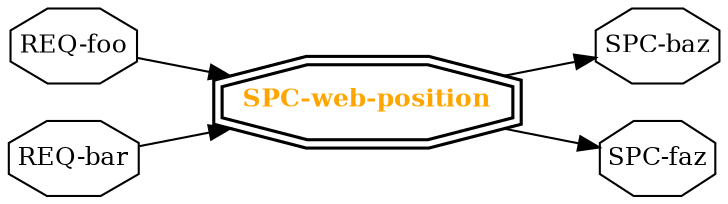

# SPC-web
There were two possible options when considering user functionality.
Because the "Local Server App" is more inline with artifact's requirements
and workflow, it is the direction we are going.

## Traditional Web Edit App
The traditional approach would be to create a credential-based multi-user 
tool allowing a whole organiztion to edit the requirements in parallel 
from a single instance. The tool would probably use a database backend
and have to integrate directly into revision control in order to specify
which user edited a certain requirement, etc.

The workflow would be:
 - admin clones the requirements repo and creates a new branch
 - admin starts the server
 - entire organization can then edit requirements directly
 - admin has to periodically: 
    - (probably) stop the server
    - apply changes from db to files
    - merge with the master branch and resolve conflicts
    - (probably) start the server

### Advantages
The traditional web-ui is more familiar and may be what a team or
organization is expecting

### Disadvantages
Although it seems simpler at first (mostly because it is known), it is NOT
simple to integrate it with the text-based nature of artifact that expects
revision control be be completely handled by the user (an advantage of being
text based).

Artifact is intended to allow separate teams to work on their own subset of
requirements and only merge with the larger org when they are done. This is
almost impossible with a traditional web-server approach.

## Local Server App
The local server approach would be to make it ultra-simple to run
the web-ui using the cmdline tool and all edits would be made directly to the
local files. As a result, edits might be slow -- but since only small teams
would be working on their branch's server, speed is not critical.

In this approach authentication is not necessary (although can possibly
be added).

The general workflow will be:
- developer creates a new branch in their revision control to edit
    requirements
- developer starts server with `art server IP_ADDR -e`
- developer and team make edits to the requirements via the web
- changes are reflected directly in the text
- developer makes commits (via cmdline) when needed
- when team is done, developer commits local changes and submits code review
- team and larger org review the code review using the same tools and process
    they normally use for reviewing code. 
- When done, code gets merged in.

> For the open source workflow you would just do `art server` and edit
> on `localhost`. This is intentionally looking at the "large organization"
> use case because that carries the highest risk of mising requirements.

### Advantages
- more inline with artifact's workflow
- simpler for any developer to run
- easier to merge changes (changes reflected directly in text)

### Disadvantages
- lower performance
- might not work the way some newcomers expect
- cannot support simultanious org-wide reqirements editing (must
  use revision control for organization wide editing)

# Web UI
The web interface shall be composed of these views:
1. **list view** read-only collapsable-detail list with a search bar, giving 
   the user a detailed overview of the design documents
2. **edit view** for viewing a single requirement in full and making edits to it
3. **create view** for creating a new artifact
4. **unsaved view** for seeing artifacts that have not been saved

All views shall also have:
- a navigation bar for navigating to other views
- a list of closeable logs, for displaying errors and succesful operations

# SPC-web-position

Experiment with how it looks:

# TST-web
Testing the web functionality will involve both unit testing some of the elm
code (although because of the nature of elm not much testing is necessary)
as well as testing basic features of the web ui.

- [[TST-web-basic]]: simple end to end tests designed to catch most issues
  with the web-ui from a users point of view.

# TST-web-basic
partof:
- SPC-rpc-artifacts
- SPC-web
###
These are basic end to end tests that also help test the rpc
backend since the browser directly uses it.

End-to-end tests will be written using the tool selenium. Artifact
is a fairly simple tool, however the following use cases must be tested:
- naviagation: make sure all references complete and navbar changes for
  all links.
    - Start at list, go to artifact, click link in "parts", click link
      in text. 
    - Start at full url, navigate back to list.
    - Start at full url, switch to different url.
    - Go to invalid url
    - Start at full url, click invalid link
- editing: make sure editing works as expected
    - Go to full url. Edit text. Validate file has changed. Go to list,
      click on edited artifact and verify it changed. Refresh and
      verify again.
    - In first thread go to full url. In second thread, go to same url and change text.
      In first thread, try and change text. Expect error.
    - etc
