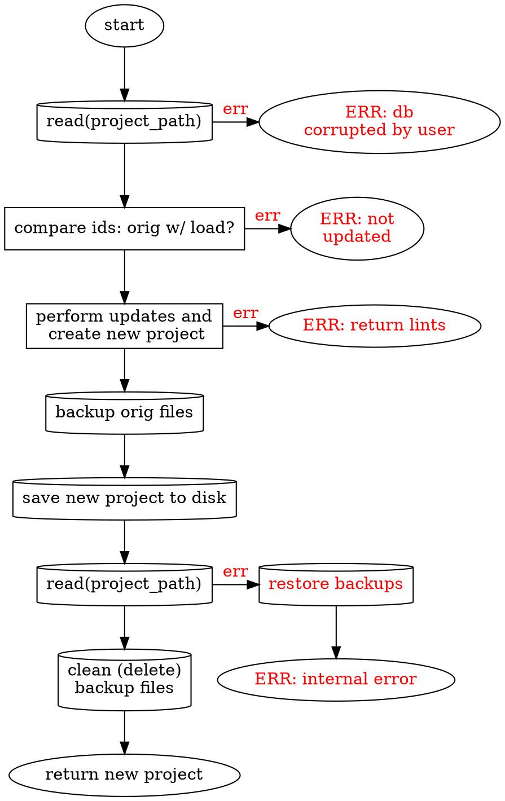

# SPC-modify
partof: REQ-data
###
The modify operation takes in only the `project_path` and an array of
`ArtifactOp` (see [[SPC-structs]]).

From there, the control flow and high level architecture are
as follows:

Overall this is *relatively simple*. The only new stuff is:
- [[.compare_id]]: compare the `orig_hash` of the requested changes to the hashes
  of the loaded values. If they don't match it means that the person requesting changes
  did so *with an out of date version of the artifact*. This is a no-no!
- [[SPC-modify-update]]: update the loaded project with the requested changes.
- [[.backup]]: backup files by moving them to (for example) `path/to/file.md` ->
  `path/to/file.md.art_bk`. Restoring is just moving them back to their
  original place. Cleaning is just deleting them.

> This requires a LOT of filesystem operations, some of them seemingly
> redundant. However, I believe all of them are justified. Theoretically we
> could remove the "checking" one at the very end, but I prefer to keep it for
> a *very* long time.

# SPC-modify-update
We are given a `Vec<ArtifactOp>` and loaded `Project` and we want to perform
the requested updates on the project, ensuring there are no new errors.

The basic process is:
- Ensure that there are no conflicts in the `ArtifactOp`'s original `HashIm`s
  or new `HashIm`s. For instance, ensure that they aren't trying to delete
  and create the same `HashIm`.
- We _already have_ the project as a `Map<HashIm, ArtifactIm>`.
- Note: we don't care in the next phase about whether `Name`s colide. We are
  hashed by `HashIm`, NOT by `Name`!
- We simply perform the operations requested -- blindly changing the artifacts.
  - `ArtifactOp::Create` is inserting the `HashIm` into the map with the new
    artifact.
  - `ArtifactOp::Update` is removing the original `HashIm` and inserting the
    new one.
  - `ArtifactOp::Delete` is deleting the requested `HashIm`
- We then rebuild the project and do all _error level_ lints.