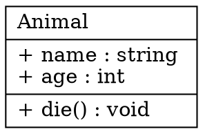

# SPC-structs
partof: REQ-data
###
This requirement details the high level `struct`s and `enum`s that must be
exported by this module, as well as their features.

In many cases this would be a *specification*, but since this is a library,
the exported structs and their characteristics practically ARE the
requirement.

It's critical that the valid types are defined at a high level, since
they determine how everything works together.

### Exported Types
These are the types that make up the exported "product" of this library. The
major type is the **Artifact** and its associated **Name**.

TODO: this graph broke with the update to newer graphiz. Rewrite with the format below.

```dot
digraph G {
    node [shape=plaintext];

    Type [label=<
<TABLE ALIGN="left" BORDER="0" CELLBORDER="1" CELLSPACING="0">
  <TR><TD PORT="self" BGCOLOR="gray"><b>Type</b></TD><TD><i>enum</i></TD></TR>
  <TR><TD>REQ               </TD><TD PORT="req" >               </TD></TR>
  <TR><TD>SPC               </TD><TD PORT="spc" >               </TD></TR>
  <TR><TD>TST               </TD><TD PORT="tst" >               </TD></TR>
</TABLE>>];

    Name [label=<
<TABLE ALIGN="left" BORDER="0" CELLBORDER="1" CELLSPACING="0">
  <TR><TD PORT="self" BGCOLOR="gray"><b>Name</b></TD><TD><i>struct</i></TD></TR>
  <TR><TD PORT="ty">ty      </TD><TD>Type           </TD></TR>
  <TR><TD>key               </TD><TD PORT="key" >String         </TD></TR>
  <TR><TD>raw               </TD><TD PORT="raw" >String         </TD></TR>
</TABLE>>];

    Artifact [label=<
<TABLE ALIGN="left" BORDER="0" CELLBORDER="1" CELLSPACING="0">
  <TR><TD PORT="self" BGCOLOR="gray"><b>Artifact</b></TD><TD><i>struct</i></TD></TR>
  <TR><TD PORT="name">name      </TD><TD>Name                       </TD></TR>
  <TR><TD>file                  </TD><TD PORT="file">Set[PathAbs]   </TD></TR>
  <TR><TD PORT="pof" >partof    </TD><TD>Set[Name]                  </TD></TR>
  <TR><TD PORT="pts" >parts     </TD><TD>Set[Name]                  </TD></TR>
  <TR><TD>completed         </TD><TD PORT="comp">Completed          </TD></TR>
  <TR><TD>text              </TD><TD PORT="text">String             </TD></TR>
  <TR><TD PORT="impl">impl_ </TD><TD>Implementation </TD></TR>
  <TR><TD>subnames          </TD><TD PORT="sub" >Set[SubName]       </TD></TR>
  <TR><TD>orig_hash         </TD><TD PORT="hash">HashIm[PathAbs]    </TD></TR>
</TABLE>>];

    Completed [label=<
<TABLE ALIGN="left" BORDER="0" CELLBORDER="1" CELLSPACING="0">
  <TR><TD PORT="self" BGCOLOR="gray"><b>Completed</b></TD><TD><i>struct</i></TD></TR>
  <TR><TD>tst               </TD><TD PORT="tst" >f32            </TD></TR>
  <TR><TD>spc               </TD><TD PORT="spc" >f32            </TD></TR>
</TABLE>>];

    Impl [label=<
<TABLE ALIGN="left" BORDER="0" CELLBORDER="1" CELLSPACING="0">
  <TR><TD PORT="self" BGCOLOR="gray"><b>Impl</b></TD><TD><i>enum</i></TD></TR>
  <TR><TD>Done              </TD><TD PORT="done">String                 </TD></TR>
  <TR><TD>Code              </TD><TD PORT="code">ImplCode               </TD></TR>
  <TR><TD>NotImpl           </TD><TD PORT="not" >                       </TD></TR>
</TABLE>>];

    ImplCode [label=<
<TABLE ALIGN="left" BORDER="0" CELLBORDER="1" CELLSPACING="0">
  <TR><TD PORT="self" BGCOLOR="gray"><b>ImplCode</b></TD><TD><i>struct</i></TD></TR>
  <TR><TD>primary           </TD><TD PORT="prim">Option[CodeLoc]        </TD></TR>
  <TR><TD>secondary         </TD><TD PORT="sec" >Map[SubName, CodeLoc]  </TD></TR>
</TABLE>>];

    CodeLoc [label=<
<TABLE ALIGN="left" BORDER="0" CELLBORDER="1" CELLSPACING="0">
  <TR><TD PORT="self" BGCOLOR="gray"><b>CodeLoc</b></TD><TD><i>struct</i>  </TD></TR>
  <TR><TD>file              </TD><TD PORT="file">PathAbs            </TD></TR>
  <TR><TD>line              </TD><TD PORT="line">usize              </TD></TR>
  <TR><TD>col               </TD><TD PORT="col" >usize              </TD></TR>
</TABLE>>];

    PathAbs [label=<
<TABLE ALIGN="left" BORDER="0" CELLBORDER="1" CELLSPACING="0">
  <TR><TD PORT="self" BGCOLOR="gray"><b>PathAbs</b></TD><TD><i>newtype</i></TD></TR>
  <TR><TD>0                 </TD><TD PORT="path">PathBuf        </TD></TR>
</TABLE>>];

    SubName [label=<
<TABLE ALIGN="left" BORDER="0" CELLBORDER="1" CELLSPACING="0">
  <TR><TD PORT="self" BGCOLOR="gray"><b>SubName</b></TD><TD><i>struct</i></TD></TR>
  <TR><TD>raw                   </TD><TD PORT="raw" >String      </TD></TR>
  <TR><TD>key                   </TD><TD PORT="key" >String      </TD></TR>
</TABLE>>];

    { rank = same {Type, Name, Artifact, Completed}}
    Artifact:name   -> Name [constraint=false];
    Artifact:pof    -> Name [constraint=false];
    Artifact:pts    -> Name [constraint=false];
    Artifact:comp   -> Completed;
    Name:ty         -> Type [constraint=false];

    { rank = same {Impl, ImplCode, CodeLoc, PathAbs}}
    Artifact:impl   -> Impl;
    Impl:code       -> ImplCode;
    ImplCode:prim   -> CodeLoc;
    ImplCode:sec    -> CodeLoc;
    CodeLoc:file    -> PathAbs;
    Artifact:file   -> PathAbs;

    Artifact:sub    -> SubName
    ImplCode:sec    -> SubName;
}
```

### Raw Data Types
These types define the "raw data" format of artifact and are only used
for de/serializing.

#### [[.artifact_raw]]: ArtifactRaw: (stored with key of `Name`)
- done: `Option[String]`
- partof: `Option[HashSet[Name]]`
- text: `Option[TextRaw]`

#### [[.text_raw]]: TextRaw: just a newtype with some serialization guarantees
to make it prettier and ensure serialization is possible between
all of the supported formats.

### Intermediate (`Im`) Data Types
Intermediate "stripped down" forms of the artifact. These types are used for:
- linting after reading the project
- inteacting with the [[SPC-crud]] interface.

#### [[.artifact_op]]: ArtifactOp:
- `Create(ArtifactIm)`: create an artifact, it must not already exist.
- `Update(HashIm, ArtifactIm)`: update the artifact with the specified hash.
- `Delete(HashIm)`: delete the artifact with the specifed hash.

This is the "operation" command used by [[SPC-modify]] for modifying artifacts.
`Read` is ommitted as it is covered by [[SPC-read]].

#### [[.artifact_im]]: ArtifactIm:
- name: `Name`
- file: `PathAbs`
- partof: `Set<Name>` (auto-partofs are stripped)
- done: `Option<String>`
- text: `String`

The `ArtifactIm` is used to create a unique 128 bit hash of the artifacts and
for specifying *what* should be updated when an update is requested.

This is also the primary type used when linting.

#### HashIm:
This is simply a 128 bit SipHash created by the [`siphasher` crate][1].

[1]: https://doc.servo.org/siphasher/sip128/struct.Hash128.html

## Type Details
> TODO: link these directly to source code (not yet supported for REQ)

**Artifact**: the artifact is the primary exported type. It contains:
  - `name`: the unique identifier of the artifact.
  - `file`: the file where the artifact is defined.
  - `partof` and `parts`: automatic and user-defined relationship to other
    artifacts where `B in A.partof` means that B is a "parent" of A.
    More details are in [[SPC-family]].
  - `completed`: the `spc` and `tst` completion ratios, detailing how much of
    the artifact's specification and test design has been implemented.
  - `text`: the user defined text in the markdown format.
  - `impl_`: how the artifact is implemented (if it is implemented at all). Can
    be `Done(str)`, `Code(ImplCode)` or `NotIMpl`.
  - `subnames`: a list of subnames defined in `text` using `{{.subname}}`
    except `[[]]` instead of `[[]]`. These can be linked in code to complete
    the artifact.
  - `orig_hash`: the original hash of the `ArtifactIm` this was created from.

**Name**:
  - name is of the form `ART-name` where ART is one of {`REQ`, `SPC` or `TST`}
  - more details are in [[SPC-name]].

**Impl**:
  - Defines how the artifact is implemented.
  - `Done`: can be "defined as done" through the `done` field in the
    `ArtifactRaw`.
  - `Code`: can be implemented in code, where source code just puts `#ART-name`
    anywhere to mark an artifact as implemented.
