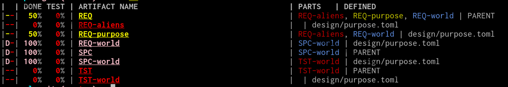

# Artifact Quick Start Guide

Artifact is a tool for helping you track your "artifacts" and link them to your
source code (making your source code self documenting).

This guide is made for those who want to just get an overview of the tool or for
developers who are already knowledgeable in requirements tracking. It is highly
recommended that most people read the short [Simple Quality][1] book, which is
the primary tutorial for artifact while also teaching quality best practices.

## Hello World Project

We will create a hello world application from start to finish. Use the
[Cheat Sheet](CheatSheet.md) and the [FAQ](FAQ.md) to help you with any
questions during this tutorial. If you are struggling, it is suggested you read
the [Simple Quality][1] book instead.

Start at the [Installation Guide](Installation.md) and install artifact on
your system.

Use an empty directory and run `art init`. Now put a requirement in
`design/purpose.toml`:
```
[REQ-purpose]
text = '''
We need to be able to say hello to both the world and aliens
'''
```

This defines the high level purpose of our "hello world" application.
We can then break this requirement down:
```
[REQ-world]
partof = "REQ-purpose"
text = '''
there shall be way to say hello to the world. All of it.
'''

[REQ-aliens]
partof = "REQ-purpose"
text = '''
there shall be a way to say hello to aliens, but that will be harder
'''
```

We used the `partof` attribute to link these to `REQ-purpose`. `REQ-purpose` now
has "parts" `REQ-world` and `REQ-aliens` and it's completion and test percentage
will depend on them.

Now we will create a design specification for `REQ-world`:
```
[SPC-world]
text = '''
The hello-world function shall print hello
'''
```

Here we did not have to use `partof` because these are linked automatically
(they are of different types with the same name). We can also define a test:
```
[TST-world]
text = '''
We will make a test later.
'''
```
Again, this is automatically a partof of `SPC-world`.

Okay, we have designed the "world" part of our application. Now we should
actually program it. We create a `src/` directory and add it to
`.art/settings.toml`
```
artifact_paths = [
    "{repo}/design"  # was already there
]
code_paths = [
    "{repo}/src",
]
```

We now create create our source code at `src/hello.py` and write:
```
def hello_world():
    """Say hello to the world
    partof: #SPC-world
    """
    print("hello world!")
```

The `#SPC-world` links this piece of code to `SPC-world`. The source code does
not have to be in python, any utf-8 file with `#SPC-name` patterns in it can be
used.

Now run: `art ls`



This lists our artifact's so far We can see that `SPC-world` is 100% done but
not tested.

Now run: `art export html`

This exports our artifacts as html. Open `index.html` in the browser of your
choice. It should look like this: https://vitiral.github.io/artifact-example/

For a more in depth tutorial, see the [Simple Quality][1] book.

[1]: https://vitiral.gitbooks.io/simple-quality/content/
